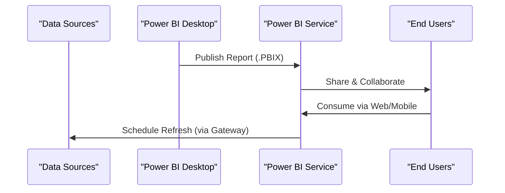
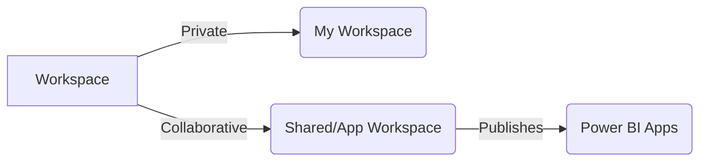
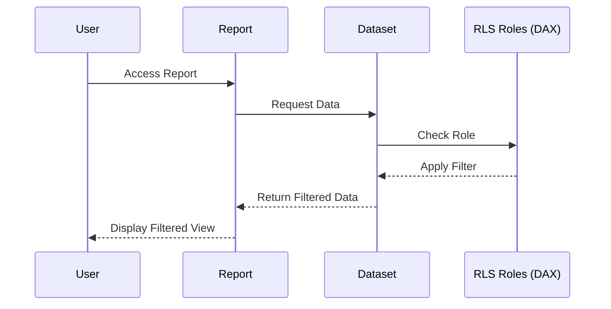
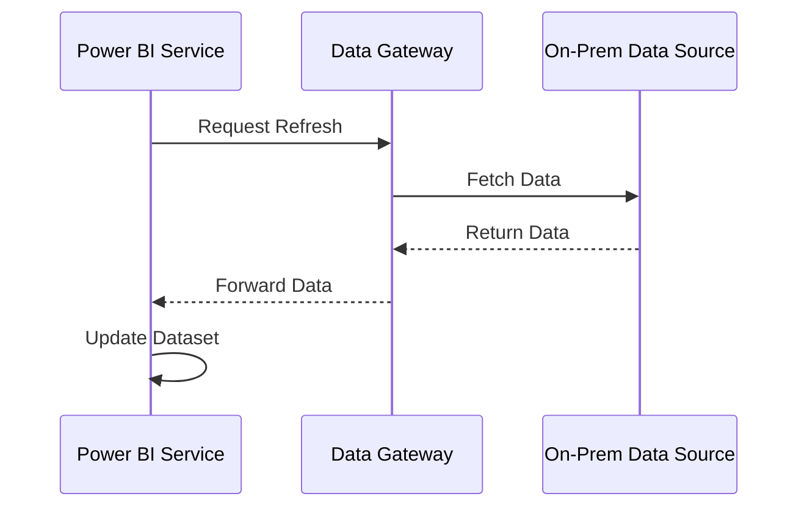
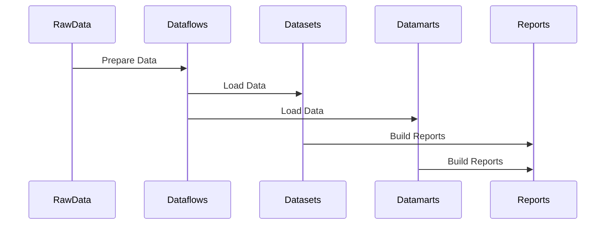

# 🚀 Power BI Service Cheat Sheet

*Master the essential concepts of Power BI Service for publishing, sharing, and collaborating on your data insights.*  

---

## 🟡 Power BI Service Overview: The Cloud Command Center

The **Power BI Service** is the secure, cloud-based platform by Microsoft that serves as the central hub for your business intelligence ecosystem. It's where the magic of data sharing, collaboration, and consumption truly happens after you've built your reports in Power BI Desktop.

- **📁 Repository:** Host your **.PBIX** files—reports, dashboards, datasets—all in one place.  
- **🔒 Secure Sharing:** Seamless collaboration across your organization (and beyond).  
- **⏰ Refresh & Alerts:** Automated data refreshes and data-driven alerts keep insights up to date.  
- **🌐 Anywhere Access:** Consume via web browser or mobile app on any device.

 

 <strong>🌊 Power BI Ecosystem Flow</strong>

 

---

## 🗂️ Workspaces: Your Collaborative Sandboxes

A **Workspace** is a container for organizing and collaborating on related Power BI content (Reports, Dashboards, Datasets, Dataflows).

- **My Workspace:** Personal sandbox—private, not directly shareable.  
- **Shared/App Workspace:** Team collaboration hub; source for **Power BI Apps**.  
- **Capacity:**  
  - **Pro license:** 10 GB per workspace  
  - **Premium/Fabric:** up to 100 TB  

 <strong>📊 Workspace Types</strong> 

 

**💡 When to Use:**  
- **My Workspace:** Drafts & personal exploration.  
- **Shared/App Workspace:** Team builds & published Apps.

---

## 📊 Reports: The Interactive Storytellers

A **Report** is a multi-page document of visuals, charts, and tables from one dataset.

- Built in Power BI Desktop, published to Service.  
- Rich interactivity: filters, slicers, drill-through.  
- Ideal for deep exploration & detailed storytelling.

**💡 Use Reports When:**  
- You need multi-page, interactive analysis.  
- Users must slice/dice and drill down.

---

## 🖼️ Dashboards: Executive Snapshots

A **Dashboard** is a single-page canvas of pinned visuals (tiles) from one or more reports.

- Created in Power BI Service only.  
- Combines visuals across reports/datasets.  
- Perfect for high-level KPI monitoring and data-driven alerts.

**💡 Use Dashboards When:**  
- You need a one-page executive overview.  
- Metrics must trigger immediate notifications.

---

## 🆚 Report vs Dashboard: A Quick Comparison

| Feature               | Report                            | Dashboard                        |
|-----------------------|-----------------------------------|----------------------------------|
| **Pages**             | Multi-page for deep analysis      | Single-page “one-pager”          |
| **Creation Tool**     | Power BI Desktop                  | Power BI Service only            |
| **Underlying Data**   | Single dataset                    | Multiple reports/datasets        |
| **Interactivity**     | High (filters, slicers, drill-through) | Limited (clicking tile navigates) |
| **Use Case**          | Detailed analysis & deep dives    | KPI monitoring & quick checks    |
| **Alerts**            | ❌                                   | ✅ data-driven alerts            |

---

## 📦 Power BI Apps: Simplified Distribution

A **Power BI App** bundles curated reports and dashboards for broad consumption.

- Built in App Workspaces; delivers a view-only experience.  
- Simplifies sharing with large audiences without workspace access.

**💡 When to Use Apps:**  
- To distribute polished content at scale.  
- For version-controlled, production-ready experiences.

 
 <strong>💳 Viewer Licensing</strong> 

| Viewer License    | Required? | Scenario                                                         |
|-------------------|-----------|------------------------------------------------------------------|
| **Free**          | ✅        | If App is on Premium/Fabric capacity                             |
| **Pro**           | ✅        | Standard Pro workspace (publisher & viewer both need Pro)        |
| **PPU**           | ✅        | Personal Premium (paginated reports, AI, 48 refreshes/day)       |
 

---

## 💳 Power BI License Types & Pricing

Microsoft offers flexible licensing for various needs, from individual use to enterprise-wide deployments.

| License Type        | Cost (USD)        | Sharing      | Key Features / Use Case                                                |
|---------------------|-------------------|--------------|-------------------------------------------------------------------------|
| **Free**            | $0                | ❌ no sharing | Individual analysis; view content in Premium capacity                   |
| **Pro**             | ~$10/user/month   | ✅ Pro↔Pro    | Team collaboration; shared workspaces; 8 refreshes/day                  |
| **PPU**             | ~$20/user/month   | ✅ PPU↔PPU    | All Pro + Premium features (paginated, AI) ; 48 refreshes/day          |
| **Premium/Fabric**  | From $262/month   | ✅ with Free  | Dedicated resources; enterprise-scale; advanced AI; auto-scaling       |

*Costs approximate; vary by region & enterprise agreements.*

---

## 🔐 Power BI Security: Safeguarding Your Data

### Workspace Roles

Assign roles to control content management:

| Role          | Key Capabilities                                                             |
|---------------|-------------------------------------------------------------------------------|
| **Admin**     | Full control: manage access, publish apps, delete content                     |
| **Member**    | Create/edit content, publish apps, schedule refreshes; cannot manage access   |
| **Contributor** | Create/edit content; cannot publish apps—ideal for devs                    |
| **Viewer**    | View-only access to published content                                         |

 <strong>🔒 RLS Flow</strong>

**Row-Level Security (RLS):** Defined in Desktop, managed in Service to filter rows per user.

---

## 🛡️ Additional Security Layers & Best Practices

| Security Layer    | Description                                                                              |
|-------------------|------------------------------------------------------------------------------------------|
| **Authentication**| Azure Active Directory (AAD) identity verification                                       |
| **Authorization** | Workspace roles & RLS govern data access                                                |
| **Encryption**    | Data encrypted at rest & in transit (HTTPS/TLS)                                          |
| **Tenant Settings** | Admin controls for export, sharing, and sensitivity policies                         |
| **Sensitivity Labels** | Classification via Microsoft Purview (e.g., “Confidential”)                      |

**Best Practices:**
- Principle of least privilege  
- Use dynamic RLS for scalability  
- Enforce MFA for all users  
- Apply sensitivity labels to sensitive reports  
- Audit workspace access & usage logs regularly  

---

## 🔄 Data Refresh & Gateways: Keeping Insights Fresh

- **Data Refresh:** Updates service datasets from sources.  
- **Data Gateway:** Secure bridge to on-premises data (SQL Server, local files).  
- **Scheduled Refresh:** Pro (8/day), Premium/Fabric (48/day).

 <strong>🔠Refresh Flow</strong>

 

---

## ⚙️ Other Key Service Components

- **Datasets:** Import vs DirectQuery modes for data storage & query.  
- **Dataflows:** Self-service ETL to prepare & reuse data.  
- **Datamarts:** Managed Azure SQL DB for analytics between flows & warehouses.  
- **Deployment Pipelines:** (Premium/PPU) Manage content lifecycle across dev→test→prod.

 <strong>🔧 Advanced Components Flow</strong>

 