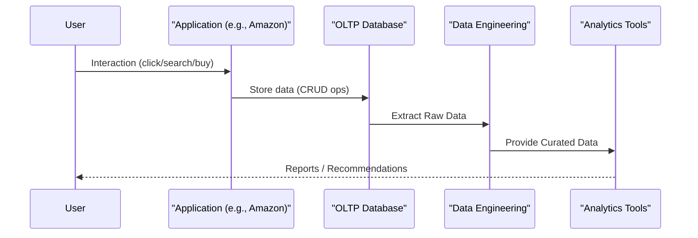
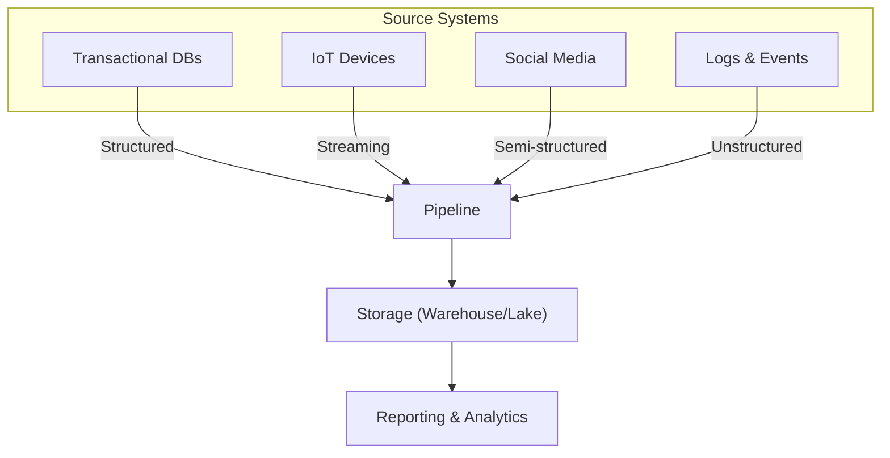

# 🚀 Introduction to Data Engineering

This report provides a comprehensive exploration of **Data Engineering**, a field that forms the bedrock of modern data-driven organizations. It guides individuals from foundational understanding to expert grasp of data warehousing and broader data engineering principles.

---

## 🧠 What is Data Engineering?

Data Engineering is about taking raw, often messy data, refining it, and delivering it in the form of **data models** or **cleaned, structured formats** to stakeholders.

Think of it like a **skilled chef**:
> Takes raw ingredients → Prepares & Cooks → Serves a dish  
> Just as a chef prepares ingredients, a Data Engineer ensures **data is ready for analysis**.

```mermaid
graph LR
    "Raw Data" --> "Clean & Structured"
    "Clean & Structured" --> "Data Model"
    "Data Model" --> "Stakeholders"
```

> **Purpose:** Enable data-driven decision-making by making data **usable and understandable**.

It involves:
- Designing & maintaining data systems
- Structuring chaotic data
- Enabling data scientists and analysts with clean datasets

> Without data engineering, advanced analytics and machine learning are not feasible.

---

## 💡 Why Data Engineers are Essential

```mermaid
graph TD
    "Big Data Explosion" --> "High Volume + Velocity + Variety"
    "High Volume + Velocity + Variety" --> "Traditional Methods Fail"
    "Traditional Methods Fail" --> "Need for Data Engineers"
    "Data Engineers" --> "Reliable Infrastructure"
    "Data Engineers" --> "Accessible, Clean Data"
    "Data Engineers" --> "Enable Analytics, ML, BI"
```

Modern businesses:
- Generate **colossal amounts of data** from diverse sources
- Need **real-time insights** to stay competitive
- Rely on **Data Engineers** to ensure quality, availability, and performance

---

## 🏢 The Core Business and Data Generation

Internet companies (Amazon, Netflix, Zomato) operate by:
- Understanding customers
- Increasing profits
- Detecting fraud/anomalies

Every interaction (click, purchase, like) **generates data**.



---

## 🔗 Diverse Data Sources

Data Engineers work with:

- **Transactional Systems (RDBMS):** Real-time operations  
- **IoT Devices:** Continuous data streams  
- **Web/Social Media:** Semi-structured user activity  
- **Machine Logs:** Unstructured operational data  



---

## 🧭 Summary

Data Engineering is the **backbone** of modern enterprises:
- Structures chaos into insight
- Powers analytics and AI
- Builds scalable, trusted data pipelines

---

✅ You can now upload this file to GitHub Pages as a clean, duplicate-free, and visually organized Markdown file.
