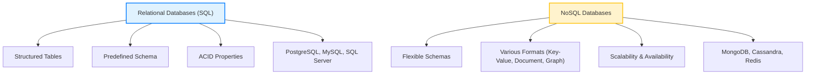
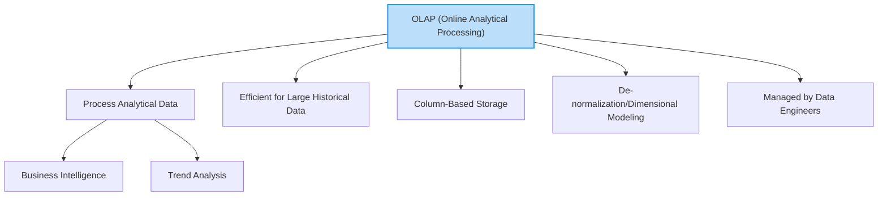

# 📦 Chapter 3: Data Storage and Processing Systems

This section delves into the foundational systems employed for storing and processing data, which are indispensable for building robust data architectures, including data warehouses. A thorough understanding of these components is crucial for any aspiring data expert.

---

## A. Database Management Systems (DBMS)

A **Database Management System (DBMS)** is a software solution meticulously designed to efficiently manage, organize, and retrieve data in a structured manner. It stands as a critical component in modern computing, empowering organizations to effectively store, manipulate, and secure their data, thereby supporting data-driven decision-making and operational efficiency.

### 1. Purpose and Operations

The primary purpose of a DBMS is to provide a structured environment for data storage, facilitating easy querying and efficient handling of vast quantities of records. A well-implemented DBMS:
- Minimizes data redundancy
- Prevents inconsistencies
- Supports CRUD operations (Create, Read, Update, Delete)
- Supports multiple database languages:
  - **DDL** (CREATE, ALTER, DROP)
  - **DML** (SELECT, INSERT, UPDATE, DELETE)
  - **DCL** (GRANT, REVOKE)
  - **TCL** (COMMIT, ROLLBACK, SAVEPOINT)

> Without a robust DBMS, data would exist in a state of chaos.

### 2. Types: Relational (SQL) vs. NoSQL

### 3. The Importance of SQL

**SQL (Structured Query Language)** is the standardized language used to communicate with and manage relational databases. It’s considered the **backbone of a data career**.

---

## B. OLTP (Online Transaction Processing) Systems

**OLTP systems** are optimized for fast processing of small, frequent transactions (e.g., ATM, e-commerce). Key characteristics:
- Row-based storage
- Normalization (1NF, 2NF, 3NF)
- Real-time inserts/updates
- Managed by **DBAs**

---

## C. OLAP (Online Analytical Processing) Systems

**OLAP systems** (a.k.a. Data Warehouses) are optimized for reading and aggregating large historical datasets.

---

### 🔁 Table: OLTP vs OLAP Comparison

| Criteria            | OLTP                                | OLAP (Data Warehouse)                         |
|---------------------|-------------------------------------|-----------------------------------------------|
| **Purpose**         | Real-time transactions              | Historical analysis & decision-making         |
| **Data Model**      | Normalized                          | Star/Snowflake schema                         |
| **Performance**     | Millisecond response                | Seconds to minutes                            |
| **Volume**          | GB                                  | TB–PB                                         |
| **Examples**        | ATM, order processing               | BI tools, financial analysis                  |

---

## D. ETL (Extract, Transform, Load) Pipelines

ETL is the traditional data integration approach where transformation happens **before** loading into the warehouse.

### 1. ETL Process Stages
- **Extract**: Pull from SQL/NoSQL, JSON, flat files
- **Transform**: Cleanse, standardize, deduplicate, derive columns
- **Load**: Insert into data warehouse

### 2. Data Warehouse Layers

- **Staging Layer**: Raw data holding zone
- **Core/Modeling Layer**: Business logic, schemas (Star, Snowflake)

---

## E. ELT (Extract, Load, Transform)

**ELT** shifts transformation **after loading** into cloud-native warehouses like Snowflake or BigQuery.

### ✅ ELT Advantages:
- Faster (parallel transformations)
- Handles structured & unstructured data
- Raw data preserved
- Lower infrastructure cost
- Compatible with data lakes

### ⚠️ ELT Disadvantages:
- Privacy concerns (raw data access)
- Still maturing (fewer tools/docs)

---

### 🔁 Table: ETL vs ELT Comparison

| Criteria                   | ETL                                 | ELT                                 |
|----------------------------|--------------------------------------|--------------------------------------|
| **Transform Location**     | Outside warehouse                    | Inside warehouse                     |
| **Speed**                  | Slower                               | Faster                               |
| **Flexibility**            | Low                                  | High                                 |
| **Cost**                   | Higher                               | Lower                                |
| **Raw Data Access**        | No                                   | Yes                                  |
| **Best For**               | Complex legacy systems               | Cloud-native scale systems           |

---

## F. File Formats for Big Data

- **Row-Based**: CSV, Avro (fast full row scans)
- **Column-Based**: Parquet, ORC (faster read/query)
- **Delta Format**: Layer on top of Parquet with:
  - ACID Transactions
  - Schema evolution
  - Time travel
  - Transaction logs

 
