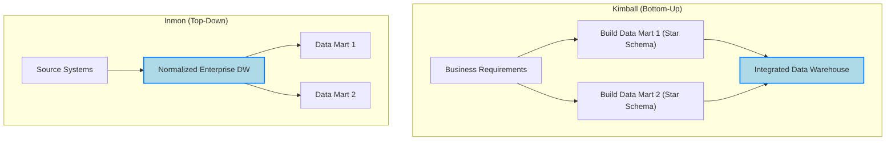

# 🚀 Chapter 4: Data Warehousing – A Deep Dive

*This chapter provides a structured overview of data warehousing concepts, architectural patterns, modeling techniques, tools, and industry applications.*

---

## 🧠 A. Core Concepts and Architecture

### 1. Data Warehouse vs. Data Marts

- **Data Warehouse (DW):** Centralized repository integrating data across the enterprise. Ideal for organization-wide analytics.
- **Data Mart (DM):** Department-focused subset of the DW. Optimized for specific team analytics.

> A Data Mart is a subset of a Data Warehouse.

---

### 2. Kimball vs. Inmon Methodologies

#### Kimball (Bottom-Up)
- Starts with business requirements and builds data marts.
- Uses **denormalized** star schemas.

#### Inmon (Top-Down)
- Begins with a **normalized** enterprise DW.
- Builds data marts downstream.

---

### 3. Dimensional Modeling: Star vs. Snowflake Schema

- **Star Schema:** Denormalized; simpler, faster queries.
- **Snowflake Schema:** Normalized; less redundancy, more complex joins.

---

### 4. Slowly Changing Dimensions (SCDs)

| Type  | Description                               |
|-------|-------------------------------------------|
| SCD 0 | No change allowed                         |
| SCD 1 | Overwrite value (no history kept)         |
| SCD 2 | Add new row with history tracking         |
| SCD 3 | Keep partial history in separate columns  |
| SCD 6 | Hybrid of SCD 1, 2, and 3                 |

---

## 🛠️ B. Data Warehouse Tools and Technologies

- **Astera DW Builder** – Meta-driven automation
- **Snowflake** – Fully managed cloud DW with Time Travel
- **SAP DW Cloud** – Semantic layer + drag-and-drop modeling
- **Oracle ADW** – Cloud-native analytics platform
- **Panoply** – Managed ELT + SQL/Python transformations
- **Teradata Vantage** – Large scale SQL analytics
- **Azure Synapse** – Unified analytics platform (via Azure)
- **Hevo Data** – ETL to integrate various DWs (not DW itself)

---

## 🌐 C. Real-World Use Cases

- **Retail:** Target – Personalized marketing via Guest Data Platform  
- **Healthcare:** Kaiser Permanente – Patient risk analysis and care improvement  
- **Finance:** JPMorgan – Real-time fraud detection  
- **Manufacturing:** Siemens – Predictive maintenance & inventory optimization  
- **Telecom:** Verizon – Network optimization & churn prevention  

---

## 🔐 D. Security and Performance Optimization

### 1. Security Layers

- Access control (MFA, IAM, RBAC)
- Encryption (data at rest + transit)
- Compliance (GDPR, HIPAA, CCPA)
- SIEM, audits, patching, training

### 2. Performance Best Practices

- Optimized schema design (Star/Snowflake)
- Streamlined ETL/ELT pipelines
- Indexing + partitioning + compression
- Materialized views + caching
- Horizontal scaling + monitoring tools

---

*Data Warehousing is a strategic asset — powering analytics, enabling insights, and driving value across industries.*