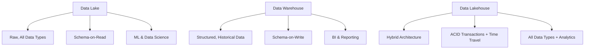
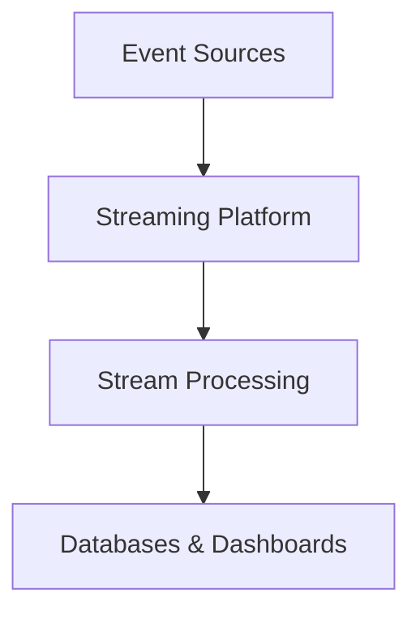
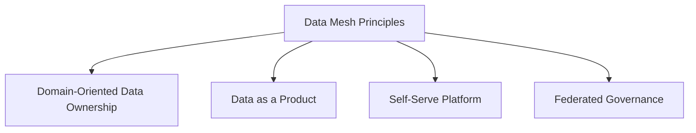
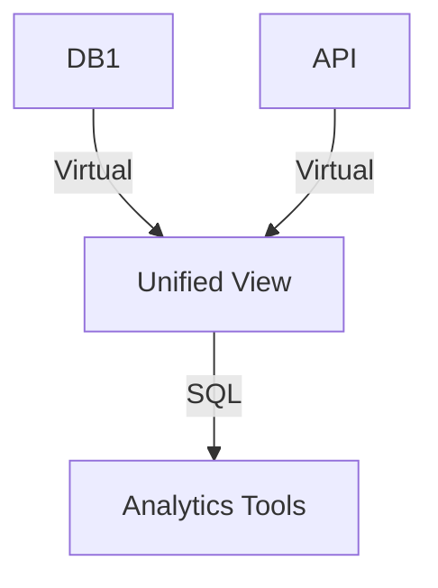
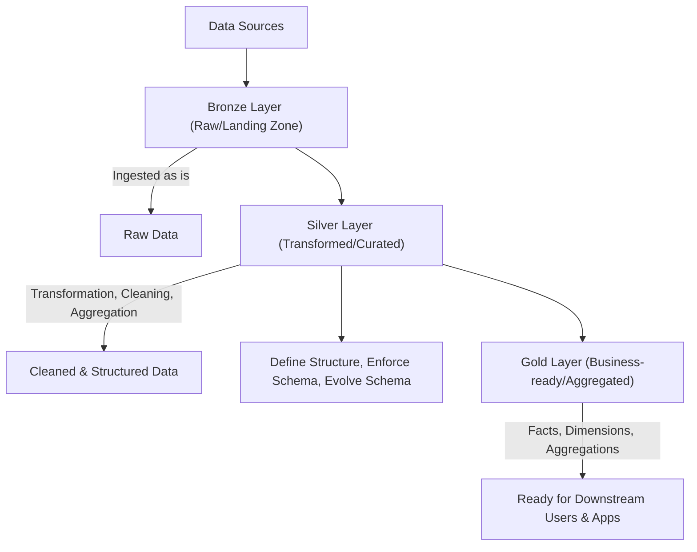

# 🌟 Chapter 5: Modern Data Concepts

The rapid evolution of data technologies has given rise to several modern concepts and architectures designed to address new challenges and unlock further opportunities in data management and analytics. These paradigms extend beyond traditional data warehousing to handle diverse data types, real-time demands, and distributed organizational structures.

---

## A. Data Lakes and Data Lakehouses

The landscape of data storage has evolved significantly, leading to distinct architectures tailored for different needs. Understanding the nuances between data lakes, data warehouses, and the hybrid data lakehouse is crucial.

* **Data Lake:** A storage repository designed to hold vast volumes of **raw data in its native format**, regardless of structure (structured, semi-structured, unstructured, e.g., logs, sensor data, social media feeds). Data lakes employ a **schema-on-read** approach, meaning structure is applied only when data is accessed, offering immense flexibility for evolving data types.
  * **Benefits:** High scalability (petabytes), cost-effectiveness, inherent flexibility.
  * **Challenges:** Can devolve into "data swamps" without governance, typically requires data science expertise, challenging for real-time queries.

* **Data Warehouse:** Optimized for analyzing **structured, historical data** for business intelligence and reporting. It uses a **schema-on-write** approach, enforcing a predefined structure at load time.
  * **Challenges:** Can be costly to implement/maintain, less flexible for unstructured data, potential scaling challenges for extremely large datasets.

* **Data Lakehouse:** A **hybrid architecture** combining the best of lakes and warehouses. It stores raw data like a data lake but offers warehouse features (ACID transactions, schema enforcement, time travel).
  * **Benefits:** Unified platform, improved data quality, reduced duplication, support for BI, ML, and real-time analytics.
  * **Limitations:** Complex implementation, requires technical expertise.

*Figure 5.1: Data Lake vs. Data Warehouse vs. Data Lakehouse*

| Criteria               | Data Lake                             | Data Warehouse                         | Data Lakehouse                              |
| ---------------------- | -------------------------------------- | --------------------------------------- | -------------------------------------------- |
| **Data Type**          | All (structured, semi/unstructured)    | Structured, historical                  | All + curated                                |
| **Schema**             | Schema-on-read                         | Schema-on-write                         | Hybrid (schema evolution)                    |
| **Cost**               | Low                                     | Higher                                  | Balanced                                     |
| **Use Cases**          | ML, exploratory analysis               | BI, dashboards                          | Unified workloads                            |

---

## B. Data Streaming

**Data streaming** processes data **in motion** for real-time insights. Architectures use durable, replayable storage (Kafka, Kinesis) and stream processors (Flink, Spark Streaming) for on-the-fly transformations.

* **Storage Layer:** Ensures low-latency, ordered reads/writes.
* **Processing Layer:** Applies windowed computations, aggregations.

Use Cases:
- Fraud detection  
- Live analytics dashboards  
- IoT monitoring  

---

## C. Data Mesh

**Data Mesh** decentralizes data ownership, treating data as a product managed by domain teams with federated governance.

1. **Domain Ownership:** Teams own their data lifecycle.  
2. **Data as a Product:** Discoverable, documented, SLA-backed.  
3. **Self-Serve Platform:** Shared infrastructure for pipelines and catalogs.  
4. **Federated Governance:** Global standards, local autonomy.

---

## D. Data Virtualization

**Data Virtualization** provides a **unified view** across disparate sources without data movement. It abstracts underlying systems, allowing real-time access via SQL or API.

* **Benefits:** Instant access, lower storage costs, agility.  
* **Use Cases:** Ad-hoc analytics, live dashboards.

---

## E. Medallion Architecture

**Medallion Architecture** defines layers in lakes/lakehouses for progressive data quality:

1. **Bronze Layer:** Raw, as-ingested data.  
2. **Silver Layer:** Cleaned, enriched data.  
3. **Gold Layer:** Curated, business-ready data.

*Figure 5.3: Bronze → Silver → Gold – Progressive Data Maturity*

---

*End of Chapter 5: Modern Data Concepts*