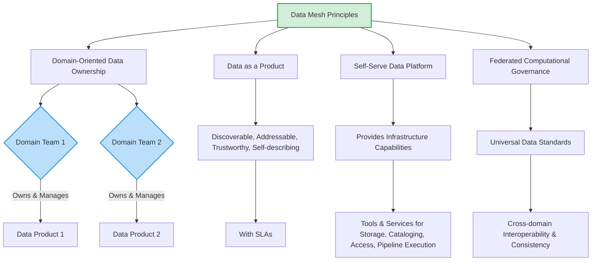

Here's the refined Markdown for Chapter 5, focusing on clarity, conciseness, and consistent formatting, while retaining all your valuable original content and integrating the Mermaid diagrams and tables.

-----

# V. Modern Data Concepts

The rapid evolution of data technologies has given rise to several modern concepts and architectures designed to address new challenges and unlock further opportunities in data management and analytics. These paradigms extend beyond traditional data warehousing to handle diverse data types, real-time demands, and distributed organizational structures.

-----

## A. Data Lakes and Data Lakehouses

The landscape of data storage has evolved significantly, leading to distinct architectures tailored for different needs. Understanding the nuances between data lakes, data warehouses, and the hybrid data lakehouse is crucial.

  * **Data Lake:** A storage repository designed to hold vast volumes of **raw data in its native format**, regardless of structure (structured, semi-structured, unstructured, e.g., logs, sensor data, social media feeds). Data lakes employ a **"schema-on-read"** approach, meaning structure is applied only when data is accessed, offering immense flexibility for evolving data types.

      * **Benefits:** High scalability (petabytes), cost-effectiveness (low-cost storage), inherent flexibility.
      * **Challenges:** Can devolve into "data swamps" without proper governance, typically requires data science expertise for analysis, challenging for real-time queries.

  * **Data Warehouse (Reiterated for comparative context):** Optimized for analyzing **structured, historical data** for business intelligence and reporting. It adheres to a **"schema-on-write"** approach, requiring data to conform to a predefined, rigid structure before loading. This upfront structuring ensures data consistency and facilitates faster querying for structured data, leading to high data quality.

      * **Challenges:** Can be costly to implement/maintain, less flexible for unstructured data, potential horizontal scaling challenges for extremely large datasets.

  * **Data Lakehouse:** A modern, **hybrid architecture** combining the best features of both data lakes and data warehouses. It leverages the low-cost, flexible storage of a data lake for all raw data types, while simultaneously providing the **data structures, management features, and powerful analytical capabilities** traditionally found in data warehouses. Data lakehouses support **"schema evolution,"** allowing flexible structures with structured organization.

      * **Benefits:** Simplified architecture (single repository), improved data quality (schema enforcement), lower costs (no separate platforms), increased reliability (reduced transfers), enhanced data governance, reduced data duplication, support for diverse workloads (BI, ML, SQL, data science) from a single source, high scalability (decoupled compute/storage).
      * **Limitation:** Increased complexity in implementation and management compared to standalone data lakes or warehouses, often requiring high technical expertise.

<!-- end list -->

```mermaid
graph TD
    DL[Data Lake] --> DL_RAW[Stores Raw, All Data Types];
    DL --> DL_SCHEMA[Schema-on-Read (Flexibility)];
    DL --> DL_ML[Good for ML & Data Science];

    DW[Data Warehouse] --> DW_STRUCT[Stores Structured, Historical Data];
    DW --> DW_SCHEMA[Schema-on-Write (Rigid)];
    DW --> DW_BI[Optimized for BI & Reporting];

    DLH[Data Lakehouse] --> DLH_HYBRID[Hybrid of Data Lake & Data Warehouse];
    DLH --> DLH_ALL[Stores all data types (Raw & Processed)];
    DLH --> DLH_STRUCT[Provides Data Warehouse features on Lake storage];
    DLH --> DLH_EVO[Supports Schema Evolution];

    style DL fill:#add8e6,stroke:#007bff,stroke-width:2px;
    style DW fill:#f8d7da,stroke:#dc3545,stroke-width:2px;
    style DLH fill:#d4edda,stroke:#28a745,stroke-width:2px;
```

*Figure 5.1: Comparison of Data Lake, Data Warehouse, and Data Lakehouse*

The emergence of the data lakehouse signifies a clear trend towards converging previously siloed data architectures. This convergence is driven by the increasing need to support diverse workloads—from traditional business intelligence to advanced machine learning—on a unified platform, while maintaining cost-efficiency and data quality. An expert understands that the data lakehouse is an architectural response to the historical challenges of managing disparate data types and workloads, aiming to provide a more streamlined, versatile, and future-proof data platform.

### Table: Comparison of Data Lake vs. Data Warehouse vs. Data Lakehouse

| Criteria               | Data Lake                                              | Data Warehouse                                            | Data Lakehouse                                                |
| :--------------------- | :----------------------------------------------------- | :-------------------------------------------------------- | :------------------------------------------------------------ |
| **Data Type** | Raw, all types (structured, semi-structured, unstructured). | Structured, historical data.                              | All types (structured, semi-structured, unstructured).        |
| **Schema** | Schema-on-read (flexibility).                          | Schema-on-write (predefined, rigid).                      | Hybrid; supports schema evolution.                            |
| **Querying/Performance** | Slower due to on-read schema; challenging for real-time. | Faster for structured data; more prep time.               | Fast queries + efficient processing; quick loading.           |
| **Cost** | Cost-effective (low-cost storage).                     | Can be costly to implement/maintain.                      | Lower costs (eliminates need for both).                       |
| **Data Quality** | Can degrade if not governed ("data swamp").            | High (enforced by schema-on-write).                       | Better (enforce schemas, data integrity).                     |
| **Use Cases** | Streaming data, ML, data science, raw data storage.    | Business intelligence, reporting, historical analysis.    | BI, ML, SQL, data science on unified platform.                |
| **Complexity** | Less complex than data warehouse/lakehouse.            | Moderate.                                                 | High (requires significant technical expertise).              |
| **Scalability** | High (handles petabytes).                              | Can face challenges with horizontal scaling.              | High (decoupled compute/storage).                             |

-----

## B. Data Streaming

**Data streaming** refers to data that continuously flows from a source system to a target, generated simultaneously and at high speed by numerous sources (e.g., applications, IoT sensors, log files, servers). The architecture supporting data streaming is designed for real-time consumption, storage, enrichment, and analysis of this continuously flowing data. This capability for real-time analysis provides deeper insights, enabling organizations to react quickly to changing conditions, market events, and customer issues.

The architecture for streaming data typically comprises two primary layers: a **Storage layer** and a **Processing layer**.

  * The **storage layer** must support low-cost, quick, and replayable reads and writes of large data streams, ensuring strong consistency and record ordering.
  * The **processing layer** consumes data from the storage layer, performs computations, and manages data no longer needed.

The emphasis on "continuously flowing," "high speed," and "real-time consumption" signifies a strong industry shift from purely batch-oriented processing to **real-time capabilities**, driven by business needs for immediate insights.

Key tools in the data streaming ecosystem include stream processors like **Apache Kafka, Amazon Kinesis, Google Pub/Sub, and Azure Event Hubs**. For querying data streams directly, **KSQL (ksqlDB)** is utilized. For storing streamed data, options include **Amazon S3, Amazon Redshift, and Google Storage**.

Data streaming finds application in a wide array of real-world scenarios: streaming media, stock trading, real-time analytics for BI, fraud detection, IT monitoring, instant messaging, IoT device monitoring, and personalized customer experiences. This highlights that modern data engineering increasingly involves designing systems that handle **data in motion**, not just data at rest, necessitating a different set of tools and architectural patterns than traditional batch processing.

-----

## C. Data Mesh

**Data Mesh** is a decentralized data architecture paradigm that fundamentally shifts how data is managed and consumed within large organizations. It proposes treating data as a product, with ownership and responsibility distributed among domain-oriented teams, aiming to overcome scalability and autonomy challenges in traditional, centralized data architectures.

The Data Mesh is built upon several key principles:

  * **Domain-Oriented Data Ownership:** Accountability for data is distributed to **cross-functional teams aligned with specific business domains** (e.g., sales, marketing, product). Each domain team is responsible for its data's entire lifecycle, including ingestion, cleaning, and aggregation, effectively managing its own data pipelines.
  * **Data as a Product:** Data assets produced by domain teams are treated as **high-quality products**. This means they are designed to be discoverable, addressable, trustworthy, self-describing, and secure, complete with defined **Service Level Agreements (SLAs)** for their consumers.
  * **Self-Serve Data Platform:** To prevent duplication of effort, a central platform provides **domain-agnostic data infrastructure capabilities**. This platform offers tools and services for storage, cataloging, access controls, and pipeline execution, enabling domain teams to easily serve their data autonomously.
  * **Federated Computational Governance:** A **universal set of data standards** and agreed-upon SLAs are established across all domains, facilitating seamless cross-domain collaboration and interoperability. This ensures consistency in areas like data formatting, discoverability, and metadata in a decentralized environment.

<!-- end list -->



*Figure 5.2: Data Mesh Principles*

The principles of Data Mesh directly challenge the traditional centralized data warehouse model. The emphasis on "domain-oriented ownership" and "data as a product" reflects a significant shift in organizational thinking, viewing data not merely as a technical byproduct but as a core business asset with its own lifecycle and dedicated consumers. An expert understands that Data Mesh is not just a technical architecture but a profound **organizational and cultural transformation**. It aims to unlock data's value by empowering domain teams, but also introduces complexities in maintaining global consistency and coordination across a distributed data landscape.

-----

## D. Data Virtualization

**Data virtualization** is a modern data engineering concept that enables organizations to access and integrate data from disparate sources into a single, unified view **without the need for physical data movement or replication**. It creates a single **semantic virtual layer** that sits atop various physical data sources, allowing users to interact with the data as if it resided in one centralized location, regardless of its actual physical format or location.

The core benefits of data virtualization are numerous:

  * Significantly **simplifies data access** by providing a unified interface to diverse data sources.
  * **Substantial savings** in storage space and a reduction in data management complexity by eliminating manual data movement and replication.
  * Fosters **increased data agility**, allowing quicker access and analysis without the overhead of physical integration.

At a high level, data virtualization operates by connecting to various relational and non-relational data sources. Users virtualize specific tables or datasets, and these virtual objects can then be joined to create a consolidated view. Once established, these virtual objects can be queried using standard SQL and consumed by other applications, dashboards, or data catalogs. The primary promise of data virtualization is to access data without physically moving it. This directly addresses the challenges of traditional ETL processes (time, cost, complexity) and the growing need for immediate access to diverse, distributed data. It enables a more agile approach to data integration. An expert recognizes data virtualization as a powerful tool for specific use cases, particularly when real-time access to disparate, distributed data is critical and physical data movement is undesirable or impractical. It serves as a complement to, rather than a replacement for, traditional data warehousing.

-----

## E. Medallion Architecture (Cloud Data Engineering)

**Medallion Architecture** (also known as the **Bronze, Silver, Gold architecture**) is a robust data architecture pattern for cloud environments, akin to data warehouse layers. It defines distinct data quality and transformation stages for data as it flows through a data lake or lakehouse.

  * **Bronze Layer (Raw Layer/Landing Zone):**

      * Data is ingested **"as is from our source without any changes, without any transformation."**
      * Acts as a raw data repository or landing zone.
      * **"No schema needed"** initially; schema-on-read is typical here.
      * Ensures all raw data is captured and available for auditing or reprocessing.

  * **Silver Layer:**

      * This is where significant **transformation, cleaning, and aggregation** occur.
      * Data is **"transformed"** from its raw state.
      * Structure is **"defined structure," "enforce schema," and "evolve schema."** This layer often applies quality checks and initial business rules.
      * Data here is more refined, consistent, and ready for further analysis.

  * **Gold Layer:**

      * Contains **"data stored in the form of facts and dimensions or maybe aggregated tables,"** ready to be **"served"** to **"Downstream users and applications."**
      * Highly refined, denormalized, and optimized for specific business intelligence and analytical use cases.
      * Provides a clean, trustworthy source for reports, dashboards, and machine learning models.

<!-- end list -->

```mermaid
graph TD
    Source[Data Sources] --> Bronze[Bronze Layer (Raw/Landing Zone)]
    Bronze -- Ingested "as is" --> RawData[Raw Data]

    Bronze --> Silver[Silver Layer (Transformed/Curated)]
    Silver -- Transformation, Cleaning, Aggregation --> CleanedData[Cleaned & Structured Data]
    Silver --> DefineSchema[Define Structure, Enforce Schema, Evolve Schema]

    Silver --> Gold[Gold Layer (Business-ready/Aggregated)]
    Gold -- Facts, Dimensions, Aggregations --> ReadyToServe[Ready for Downstream Users & Apps]
```

*Figure 5.3: Medallion Architecture Layers*

This layered approach ensures data quality progressively improves at each stage, making it easier to manage data governance, lineage, and access controls. It provides a clear path from raw, immutable data to highly refined, business-ready information, supporting diverse consumption patterns.