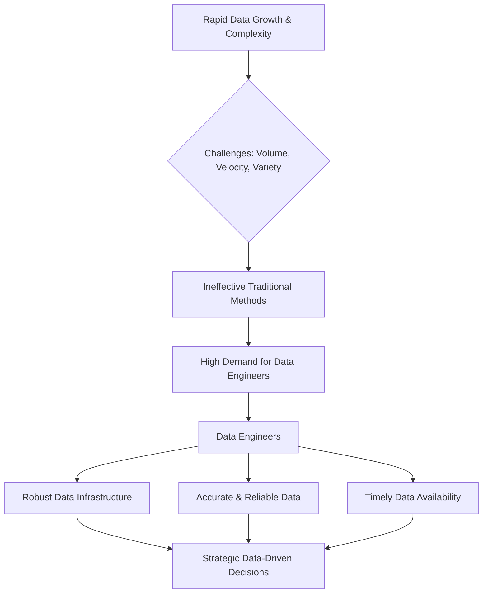
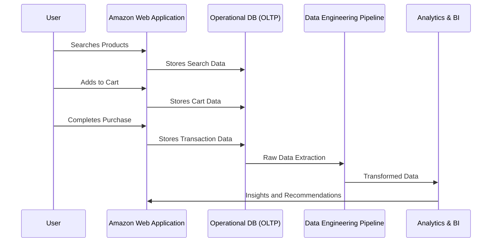
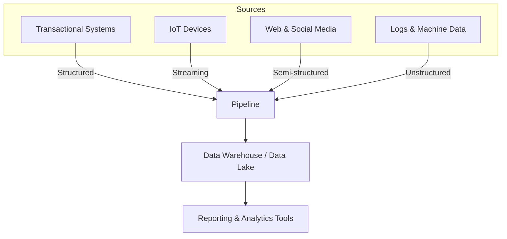

# 🚀 Introduction to Data Engineering
 

 
 

This report provides a comprehensive exploration of data engineering, a field that forms the bedrock of modern data-driven organizations. It aims to guide individuals from a foundational understanding to an expert grasp of data warehousing and broader data engineering principles. The journey begins by defining what data engineering entails and elucidating its indispensable role in today's technologically advanced landscape.

---

## What is Data Engineering?

Data Engineering is essentially about taking raw, often messy data, refining it, and delivering it in the form of data models or cleaned, structured formats to stakeholders. Think of it like a skilled chef who takes raw ingredients, meticulously prepares them, cooks them to perfection, and serves a delicious, well-prepared dish. Just as a chef ensures every ingredient is ready for consumption, a Data Engineer ensures data is ready for analysis and decision-making.

> **The core purpose of Data Engineering is to enable data-driven decision-making for businesses by making data usable and understandable.**  
> Data engineering is fundamentally the practice of designing, building, and maintaining the intricate systems that enable organizations to collect, store, and analyze data at scale. This transformation is crucial for data scientists, analysts, and other professionals who rely on clean, organized data to derive actionable insights.

### Core Steps in Data Engineering

---

## Why Data Engineers are Essential

The burgeoning volume and complexity of data, often referred to as "big data," have fundamentally reshaped the business landscape. Organizations today generate and collect colossal amounts of data from diverse sources, necessitating sophisticated storage and processing capabilities that traditional methods cannot provide.

- **Managing Complex Data Systems:** Building robust, scalable infrastructures.  
- **Ensuring Data Quality:** Guaranteeing accuracy, consistency, and reliability.  
- **Enabling Accessibility:** Providing timely data to the right stakeholders for strategic decisions.

---

## The Crucial Role of Data Engineers

---

## Core Business & Data Generation

Every digital business interaction generates data. For example, Amazon collects vast data from activities like browsing, searching, purchasing, and feedback. This data is initially stored in OLTP databases, optimized for rapid CRUD operations.

**Business Models:**  
Internet companies like Amazon (e-commerce), Netflix (content recommendation), and Zomato (food delivery) operate by providing online services. Their core goals include understanding customers, increasing profits, and detecting anomalies or fraud.

**Data Generation & Storage:**  
- **User Interactions:** Clicking, liking, commenting, purchasing, browsing.  
- **Initial Storage:** Relational DBMS optimized for CRUD operations.  

---

## Example: Amazon's Data Flow

---

## Diverse Data Sources

Data Engineers integrate data from many sources:

- **Transactional Systems:** Sales, inventory, CRM (structured).  
- **IoT Devices:** Sensors and telemetry (high velocity).  
- **Web & Social Media:** User activity (semi-structured).  
- **Logs & Machine Data:** System/application logs (unstructured).

---

## Course Overview: Mindmap

---

## Conclusion

> Data Engineering is the backbone of modern data-driven enterprises. By managing, processing, and structuring large-scale data, Data Engineers empower businesses to leverage insights, drive growth, and stay competitive in a data-rich world.
