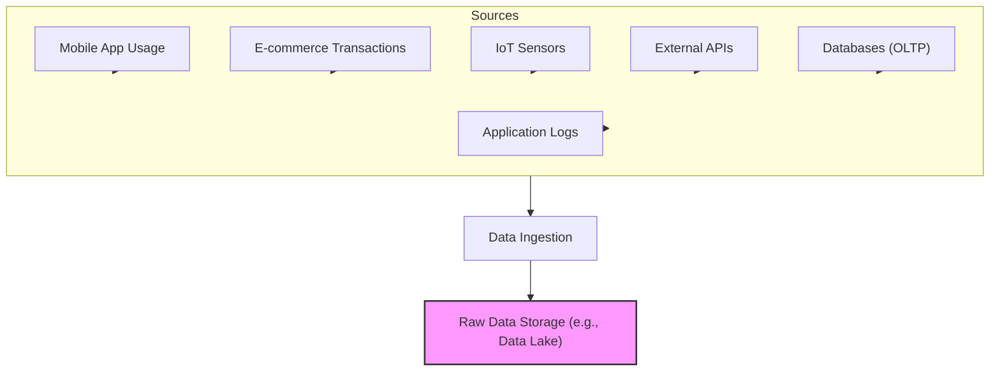
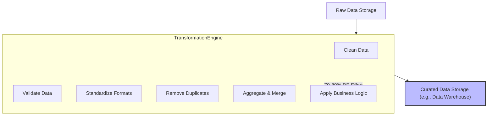
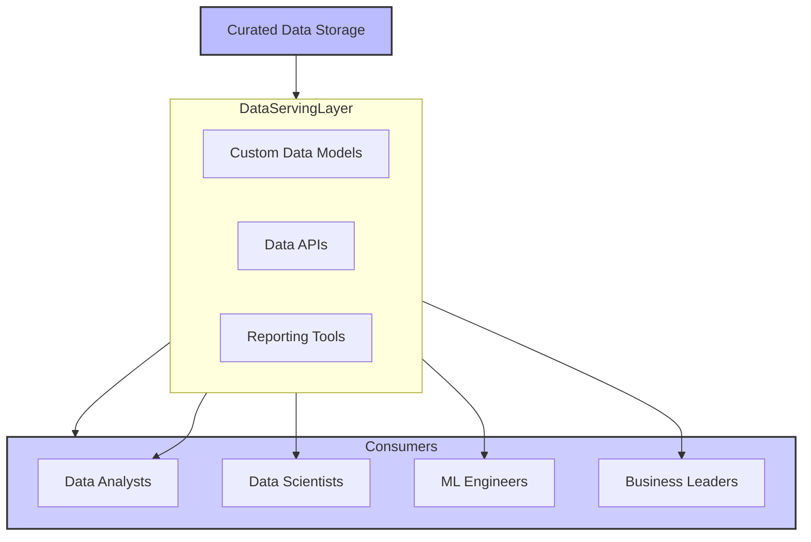
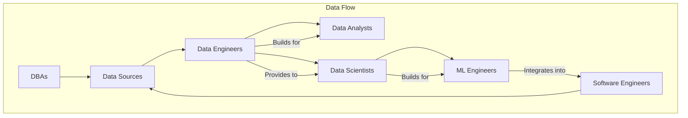
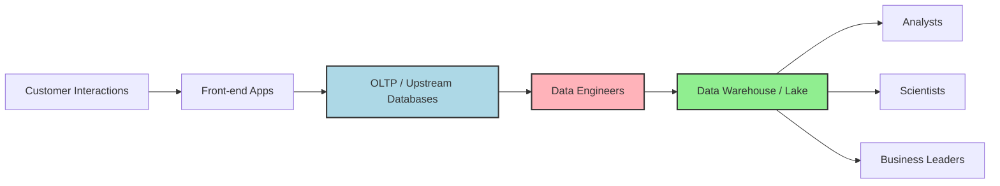

# 🚀 Chapter 2: Data Engineering Workflow & Core Concepts
 

 
 
## Three Main Pillars of Data Engineering

The data engineering workflow is built upon three fundamental pillars: **Data Production (Ingestion)**, **Data Transformation**, and **Data Serving**. Each pillar is a vital stage in bringing data to life.

### 1. Data Production (Ingestion)

This is where data begins its journey. Raw information is generated and collected from diverse sources. Data engineers must understand varied formats and structures to efficiently bring data in.

- **What it is:** Collecting raw data from its origin.
- **Data Characteristics:** Often messy, redundant, incomplete, unstructured, or semi-structured.
- **Sources:**
  - **User Interactions:** Mobile app usage, search queries, e-commerce transactions.
  - **Enterprise Systems:** APIs, Relational Databases (OLTP), IoT sensors, application logs.
- **Key Challenge:** No single ingestion method fits all due to diverse formats, volumes, and velocities.

#### 🎯 Data Production (Ingestion) Flow

---

### 2. Data Transformation

Often the most time-consuming part (~70–80% of effort). This stage converts raw, chaotic data into clean, structured, and usable "curated" data.

- **What it is:** Cleaning, structuring, and enriching raw data.
- **Why it's Crucial:** Reliable analysis depends on high-quality data.
- **Activities:**
  - Cleaning: Handling missing values and errors.
  - Validation: Checking against rules.
  - Standardization: Uniform formats.
  - Deduplication: Removing duplicates.
  - Aggregation & Filtering: Summarizing data.
  - Applying Business Logic.

#### 📈 Data Transformation Process

---

### 3. Data Serving

The final pillar, where processed data is delivered to stakeholders in consumable formats.

- **What it is:** Delivering refined data to end-users.
- **Methods:** Custom data models, APIs, reports.
- **Consumers:**
  - Data Analysts
  - Data Scientists
  - ML Engineers
  - Business Leaders

#### 📊 Data Serving & Consumption

---

## Key Roles in the Data Ecosystem

The modern data ecosystem is collaborative. Roles include:

- **Data Engineers:** Design, build, and maintain data infrastructure.
- **Data Analysts:** Interpret historical data using tools like SQL and Power BI.
- **Data Scientists:** Develop predictive models.
- **ML Engineers:** Deploy and operationalize ML models.
- **Software Engineers:** Build applications and data connectors.
- **DBAs:** Manage database systems and ensure data integrity.

#### 👥 Data Ecosystem Roles & Interactions

---

## Upstream vs. Downstream Data

Understanding data direction clarifies responsibilities.

- **Upstream:** Data origins (OLTP systems, APIs, sensors). Managed by DBAs and software engineers.
- **Downstream:** Data consumers (analysts, scientists, leaders). Data engineers bridge the two.

#### 🌊 Upstream vs. Downstream Data Flow

---

*Figure 2.5: Upstream and Downstream Data Flow in an E-commerce Context*