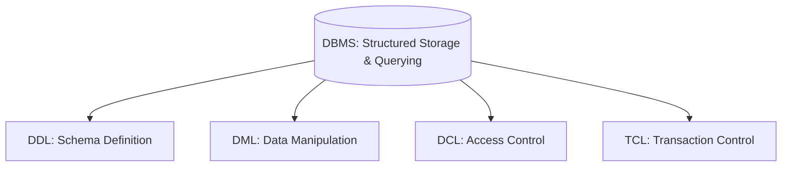
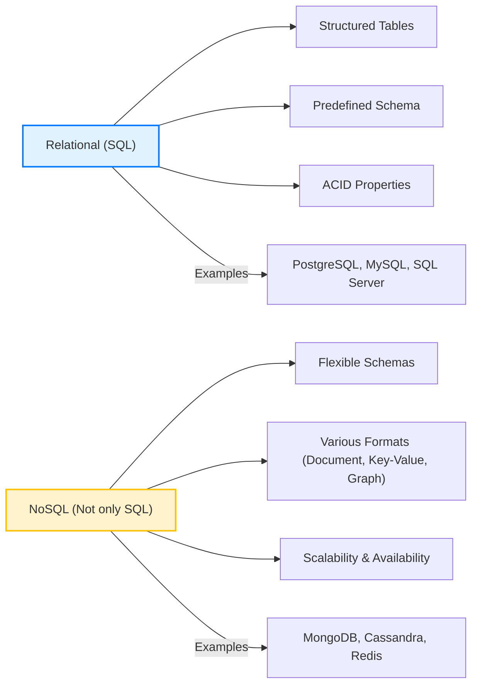
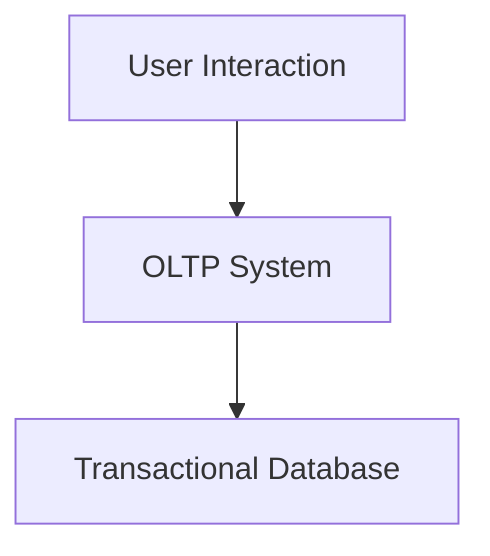
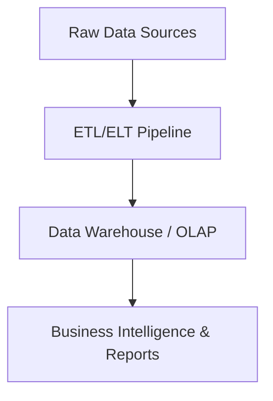
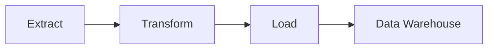
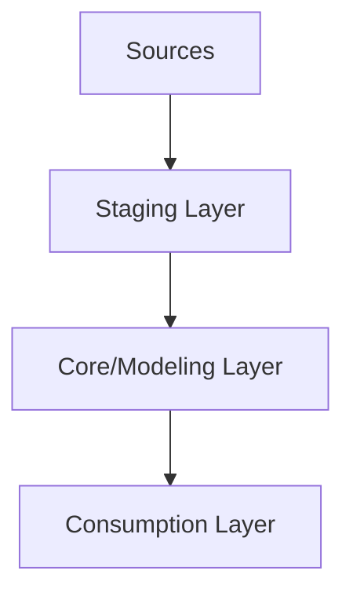
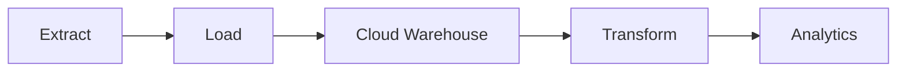
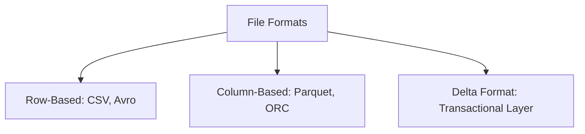

# 🚀 Chapter 3: Data Storage and Processing Systems

This chapter delves into the foundational systems for storing and processing data, indispensable for building robust data architectures like data warehouses. Understanding these components is crucial for any aspiring data expert.

---

## A. Database Management Systems (DBMS)

A **Database Management System (DBMS)** is software meticulously designed to efficiently manage, organize, and retrieve data in a structured manner. It supports fundamental data operations and ensures data integrity and availability.

### 1. Purpose & Operations

A DBMS provides a structured environment for easy querying and handling vast quantities of records, minimizing redundancy and inconsistencies. It also enables concurrent access and robust backup mechanisms.

- **DDL (Data Definition Language):** Defines and modifies the database schema (e.g., `CREATE`, `ALTER`, `DROP`).
- **DML (Data Manipulation Language):** Manages data within tables (`SELECT`, `INSERT`, `UPDATE`, `DELETE`).
- **DCL (Data Control Language):** Manages access permissions (`GRANT`, `REVOKE`).
- **TCL (Transaction Control Language):** Oversees transactions (`COMMIT`, `ROLLBACK`, `SAVEPOINT`).

**Figure 3.1:** DBMS Purpose and Operations

### 2. Types: Relational (SQL) vs. NoSQL

Databases are broadly categorized by their structure, scalability, and workload requirements.

- **Relational Databases (SQL):**  
  - Structured tables with predefined schemas  
  - ACID compliance for data integrity  
  - Ideal for complex transactions (e.g., banking systems)  
  - **Examples:** PostgreSQL, MySQL, SQL Server, Oracle  

- **NoSQL Databases:**  
  - Flexible schemas for unstructured/semi-structured data  
  - High scalability and availability (often eventual consistency)  
  - Ideal for big data, real-time web apps, IoT  
  - **Examples:** MongoDB (Document), Cassandra (Wide-Column), Redis (Key-Value), Neo4j (Graph)  

**Figure 3.2:** Comparison of Relational vs. NoSQL Databases

---

## B. OLTP (Online Transactional Processing) Systems

**OLTP systems** are designed for real-time transactional workloads, focusing on fast inserts, updates, and reads.

- **Characteristics:**  
  - Row-based storage  
  - High concurrency, low latency  
  - Normalized schemas (1NF, 2NF, 3NF)  

- **Use Cases:** E-commerce transactions, banking, ATM operations  

- **Management:** Overseen by Database Administrators (DBAs)

**Figure 3.3:** OLTP System in Action

---

## C. OLAP (Online Analytical Processing) Systems / Data Warehouses

**OLAP systems** or **data warehouses** are optimized for analytical queries over large historical datasets.

- **Characteristics:**  
  - Column-based storage for fast aggregations  
  - Denormalized schemas (star, snowflake)  
  - Read-heavy workloads  

- **Platforms:** Snowflake, Redshift, BigQuery, Azure Synapse

- **Management:** Handled by Data Engineers

**Figure 3.4:** OLAP System for Business Insights

### Comparison: OLTP vs. OLAP

| Criteria               | OLTP (Transactional)                             | OLAP (Analytical)                            |
| ---------------------- | ------------------------------------------------ | --------------------------------------------- |
| **Purpose**            | Real-time transactions                           | Historical data analysis                     |
| **Storage**            | Row-based                                        | Column-based                                  |
| **Schema**             | Normalized                                       | Denormalized                                  |
| **Workload**           | Write-heavy                                      | Read-heavy                                    |
| **Latency**            | Milliseconds                                     | Seconds to minutes                            |
| **Examples**           | Order processing, banking                        | BI reporting, forecasting                     |

---

## D. ETL (Extract, Transform, Load) Pipelines

**ETL** is the traditional process for moving data into data warehouses.

1. **Extract:** Collect raw data from diverse sources.  
2. **Transform:** Clean, validate, and structure data.  
3. **Load:** Store transformed data in target systems.

**Figure 3.5:** The ETL Process Flow

### ETL Layers

- **Staging:** Temporary raw data storage  
- **Core/Modeling:** Curated dimensional models (facts & dimensions)  
- **Consumption:** Optimized views for analytics

**Figure 3.6:** Data Warehouse Layers in ETL

---

## E. ELT (Extract, Load, Transform) Pipelines

**ELT** leverages modern cloud warehouses by transforming data inside the target system.

**Figure 3.7:** The ELT Process Flow

---

## F. Big Data File Formats

- **Row-Based (CSV, Avro):** Efficient for writes and full-row reads.  
- **Column-Based (Parquet, ORC):** Optimized for column-specific analytical queries.  
- **Delta Format:** Adds ACID transactions, time travel, and schema evolution on top of Parquet.

**Figure 3.8:** Big Data File Formats

---

> *End of Chapter 3: Data Storage and Processing Systems*
