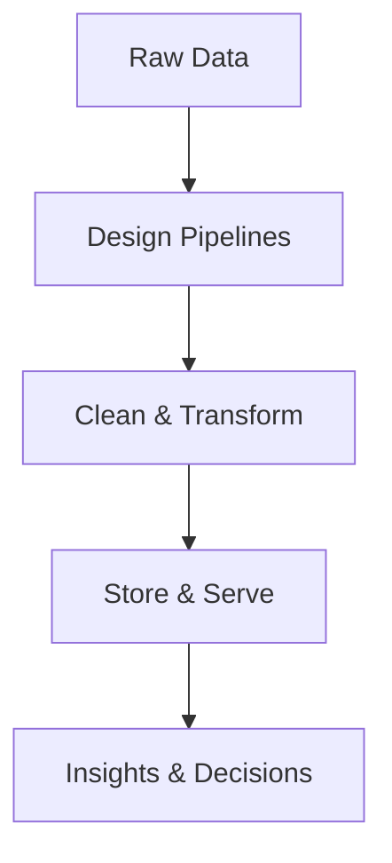
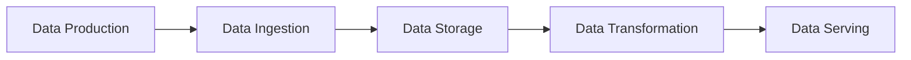
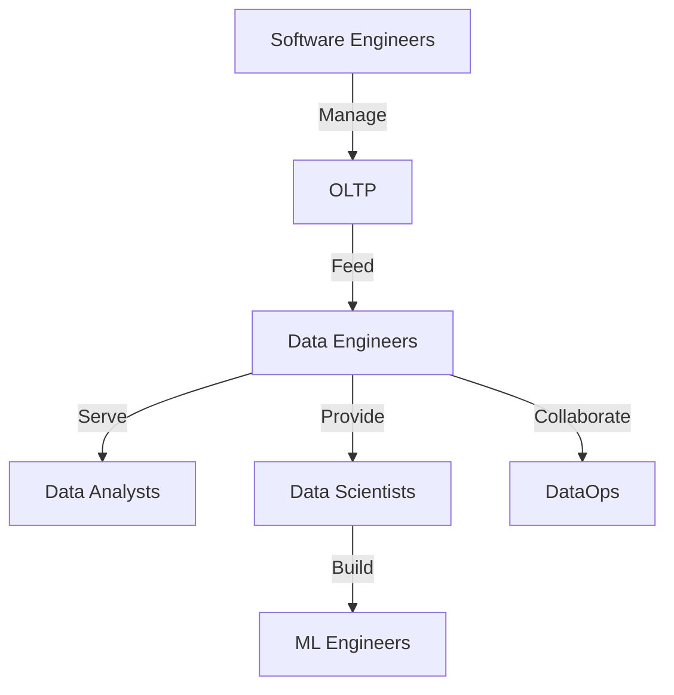

# 🚀 Fundamentals of Data Engineering: Overview

---

> **“Data is the new oil.”**  
> Data Engineering refines raw data into actionable insights by building robust pipelines and architectures.

---

## 📌 Table of Contents
1. [What is Data Engineering?](#what-is-data-engineering)
2. [Why is Data Engineering Needed?](#why-is-data-engineering-needed)
3. [Data Engineering Life Cycle](#data-engineering-life-cycle)
   - [Data Production](#data-production)
   - [Data Ingestion](#data-ingestion)
   - [Data Storage](#data-storage)
   - [Data Transformation](#data-transformation)
   - [Data Serving](#data-serving)
4. [Key Roles in the Data Ecosystem](#key-roles-in-the-data-ecosystem)
5. [Amazon Case Study](#amazon-case-study)

---

## 1. What is Data Engineering?

🧑‍🍳 **Analogy:** Like a **skilled chef** transforms raw ingredients into a gourmet dish, Data Engineers:
- **Extract** raw, messy data  
- **Refine** it into structured formats  
- **Deliver** data models ready for analysis  

> **Purpose:** Empower data-driven decision-making by making data usable & understandable.  

**Key Responsibilities:**  
- Designing scalable data architectures  
- Implementing automated pipelines  
- Ensuring data quality and governance

---

## 2. Why is Data Engineering Needed?

🌐 In today’s data-rich world, businesses must:
- Understand customers  
- Increase profits  
- Detect bottlenecks  
- Improve processes  

📈 **Challenge:** Exponential data growth creates complexity and scale issues.  
🔑 **Solution:** Data Engineers build scalable systems to harness and maintain data consistency.

**Impact:**  
- Reduces data silos  
- Improves decision accuracy  
- Enables real-time analytics

---

## 3. Data Engineering Life Cycle

This lifecycle ensures data flows seamlessly from sources to insights, maintaining quality at each step.

### 3.1. Data Production
- **Sources:** User actions, logs, IoT sensors, APIs  
- **Description:** Capturing every digital interaction as raw data.

### 3.2. Data Ingestion
- **Process:** Automated pipelines collect and transport data.  
- **Tools:** Kafka, Fivetran, Apache NiFi.

### 3.3. Data Storage
- **Options:**  
  - **OLTP** for transactional data  
  - **Data Lakes** for raw data archives  
  - **Data Warehouses** for structured analytics  
- **Considerations:** Scalability, cost, performance.

### 3.4. Data Transformation
- **Effort:** 70–80% of engineering tasks.  
- **Activities:** Cleaning, validation, enrichment.  
- **Outcome:** High-quality data ready for analysis.

### 3.5. Data Serving
- **Delivery:**  
  - Dashboards (Power BI, Tableau)  
  - Reports (Looker, Superset)  
  - ML models (TensorFlow, PyTorch)  
- **Goal:** Provide the right data to the right users.

---

## 4. Key Roles in the Data Ecosystem

A collaborative team powers data-driven insights.

- **Software Engineers:** Build applications and integrations  
- **DBAs:** Manage database reliability and performance  
- **Data Engineers:** Architect, pipeline, and govern data  
- **Data Analysts:** Derive historical insights  
- **Data Scientists:** Predict future outcomes  
- **ML Engineers:** Deploy and maintain ML solutions  
- **DataOps:** Automate and monitor data workflows

---

## 5. Amazon Case Study

**Why Amazon Needs Data Engineering:**
- Personalized recommendations  
- Inventory and supply chain optimization  
- Real-time user analytics  

**Workflow Overview:**
1. **Data Generation:** Clickstreams, orders, reviews  
2. **Data Storage:**  
   - OLTP (MySQL) for transactions  
   - Data Lake (S3) for raw logs  
   - Data Warehouse (Redshift) for analytics  
3. **ETL/ELT:** Transform formats, clean datasets  
4. **Data Serving:**  
   - BI Dashboards for executives  
   - ML models for recommendations  

> **Result:** Amazon leverages engineered data to drive customer satisfaction and operational efficiency.

---

> *This overview sets the stage. Dive into each pillar for detailed concepts, best practices, and hands-on examples.*
