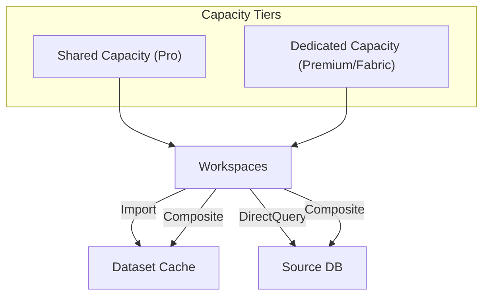
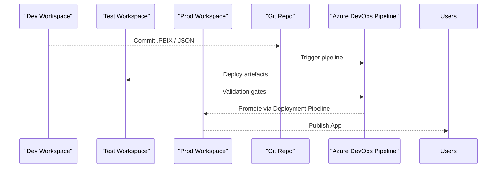

<!-- ======================================================================
     1 · Platform Foundations & Architecture  —  Power BI / Microsoft Fabric
     Author: Your Name Here
     ====================================================================== -->

<!-- Mermaid for live diagrams -->
<script src="https://cdn.jsdelivr.net/npm/mermaid/dist/mermaid.min.js"></script>
<script>
  mermaid.initialize({ startOnLoad: true, theme: 'default', securityLevel: 'loose' });
</script>

# 🏗️ Platform Foundations & Architecture

 

 
## 🛰️ Service Overview — Licensing, Capacity & Data Models

Power BI/Fabric comes in multiple licensing tiers, each with different capacity models and dataset behaviours.

| Tier / License | Capacity Model | Storage / Refresh | Typical Audience |
|---------------|---------------|-------------------|------------------|
| **Free**      | Shared         | 10 GB *(personal)* | Personal prototyping |
| **Pro**       | Shared         | 10 GB/user &nbsp;·&nbsp; 8 refreshes/day | Team collaboration |
| **Premium / Fabric** | Dedicated (F‑SKU) | Up to 100 TB/workspace &nbsp;·&nbsp; 48 refreshes/day | Enterprise & external sharing |
| **PPU**       | Personal Premium | Same as Premium (per‑user) | Power users needing Paginated, AI |

### Import vs DirectQuery vs Composite

| Mode | Where data lives | Pros | Cons |
|------|------------------|------|------|
| **Import** | Cached in Power BI | Super‑fast, full DAX | Dataset refresh overhead |
| **DirectQuery** | Source DB | Real‑time; no cache | Source load, limited DAX |
| **Composite** | Mix | Best of both | Complexity, model constraints |

<details>
<summary><strong>🏗️ Capacity & Model Architecture Diagram</strong></summary>


</details>

---

##  🌐 Tenant Architecture — Regions, Capacities, Workspaces

A **tenant** spans a geographic region and may hold multiple capacities. Each capacity contains **workspaces**, and every workspace contains *items* (reports, datasets, dataflows, notebooks, Lakehouses, etc.).

| Layer | Key Points |
|-------|-----------|
| **Tenant** | Bound to an Azure region; governed by Tenant settings |
| **Capacity** | Resource envelope (v‑cores, memory) for Premium/Fabric workloads |
| **Workspace** | Security boundary & Dev/Test/Prod landing zone |
| **Items** | Reports, Dashboards, Dataflows, Lakehouse objects, Notebooks, etc. |

 
---

##   👥 Roles & Responsibilities — RACI Matrix

| Role | R | A | C | I | Typical Tasks |
|------|---|---|---|---|---------------|
| **Tenant Admin**        |   | ✅ | ✅ | ✅ | Licensing, tenant settings, audit logs |
| **Capacity Admin**      | ✅ | ✅ | ✅ | ✅ | Manage Premium/Fabric capacities |
| **Workspace Admin**     | ✅ | ✅ |   | ✅ | Add members, publish apps, schedules |
| **Developer / Author**  | ✅ |   |   | ✅ | Build reports, datasets, dataflows |
| **Consumer / Viewer**   |   |   |   | ✅ | View & interact, set personal alerts |

✔️ = Responsibility / Accountability level as per RACI.

---

##  🚀 Deployment Lifecycle — Dev → Test → Prod with CI/CD

A simple three‑workspace promotion pattern keeps artefacts isolated yet traceable across stages.

<details>
<summary><strong>🔄 Promotion Flow Diagram</strong></summary>


</details>

**Sample Azure DevOps `azure-pipelines.yml`**

```yaml
trigger:
  branches: [ main ]

variables:
  envName: 'test'

stages:
- stage: Build
  jobs:
  - job: Export_PBIX
    pool:
      vmImage: 'ubuntu-latest'
    steps:
    - script: |
        echo "Export PBIX from source control"
- stage: Deploy
  dependsOn: Build
  jobs:
  - deployment: Deploy_to_$(envName)
    environment: $(envName)
    strategy:
      runOnce:
        deploy:
          steps:
          - task: PowerPlatformImportSolution@0
            inputs:
              authenticationType: 'ServicePrincipal'
              solutionInputFile: '**/*.pbix'
              environmentUrl: 'https://app.powerbi.com'
```

> **Tip:** Swap the `envName` variable to `prod` and add manual approval for production gates.

---

### 🎯 Key Take‑aways

1. **Know your capacity model.** Import ≠ DirectQuery, shared ≠ dedicated.  
2. **Separate workspaces by stage** to keep dev churn away from exec dashboards.  
3. **Define clear RACI** early; governance gaps cost more than extra capacity.  
4. **Automate promotes** with YAML + deployment pipelines — humans shouldn’t click “Publish to Prod”.  

---

> 📚 *Need a deeper dive?*  
> - [Power BI admin portal docs](https://learn.microsoft.com/power-bi/admin/service-admin-portal)  
> - [CI/CD with Fabric deployment pipelines](https://learn.microsoft.com/fabric/devops/deployment-pipelines/)  
> - [Pricing calculator](https://azure.microsoft.com/pricing/calculator/)  

 
