<hr style="border-top:3px solid #f9cd1b;">

<script src="https://cdn.jsdelivr.net/npm/mermaid/dist/mermaid.min.js"></script>

<style>
/* Right‑side TOC */
#toc-right {
  position: fixed;
  top: 90px;
  right: 1rem;
  width: 260px;
  max-height: calc(100vh - 120px);
  overflow-y: auto;
  background: #ffffff;
  border: 2px solid #f9cd1b;
  border-radius: 10px;
  padding: 1rem;
  box-shadow: 0 2px 8px rgba(0,0,0,0.15);
  font-size: 0.9rem;
  z-index: 999;
}
#toc-right ul { list-style: none; margin: 0; padding: 0; }
#toc-right li { margin: 0.4rem 0; }
#toc-right a { text-decoration: none; color: #0366d6; }
#toc-right a:hover { text-decoration: underline; }
@media (max-width: 992px) {
  #toc-right { display: none; }
}
</style>

<!-- 
<nav id="toc-right">
<ul>
  <li><a href="#table-of-contents">Table of Contents</a></li>
  <li><a href="#1-power-bi-service-interface-tour">1. Power BI Service Interface Tour</a></li>
  <li><a href="#2-workspaces-roles-deep-dive">2. Workspaces & Roles Deep Dive</a></li>
  <li><a href="#3-content-types-certification-endorsement">3. Content Types, Certification & Endorsement</a></li>
  <li><a href="#4-sharing-distribution-options">4. Sharing & Distribution Options</a></li>
  <li><a href="#5-admin-portal-tenant-settings">5. Admin Portal & Tenant Settings</a></li>
  <li><a href="#6-usage-metrics-monitoring">6. Usage Metrics & Monitoring</a></li>
  <li><a href="#7-data-lineage-impact-analysis">7. Data Lineage & Impact Analysis</a></li>
  <li><a href="#8-dataflows-incremental-refresh-computed-entities">8. Dataflows, Incremental Refresh & Computed Entities</a></li>
  <li><a href="#9-object-level-column-level-security-olscls">9. Object-Level & Column-Level Security (OLS/CLS)</a></li>
  <li><a href="#10-sensitivity-labels-microsoft-information-protection-mip">10. Sensitivity Labels & Microsoft Information Protection (MIP)</a></li>
  <li><a href="#11-rest-api-powershell-cli-automation">11. REST API, PowerShell & CLI Automation</a></li>
  <li><a href="#12-report-subscriptions-data-driven-alerts">12. Report Subscriptions & Data-Driven Alerts</a></li>
  <li><a href="#13-scorecards-goals-metrics">13. Scorecards (Goals) & Metrics</a></li>
  <li><a href="#14-paginated-reports-integration">14. Paginated Reports Integration</a></li>
  <li><a href="#15-mobile-app-experience-offline-caching">15. Mobile App Experience & Offline Caching</a></li>
  <li><a href="#16-real-time-dashboards-streaming-datasets">16. Real-Time Dashboards & Streaming Datasets</a></li>
  <li><a href="#17-embedding-scenarios">17. Embedding Scenarios</a></li>
  <li><a href="#18-ai-powered-features">18. AI-Powered Features</a></li>
  <li><a href="#19-microsoft-fabric-onelake-integration">19. Microsoft Fabric & OneLake Integration</a></li>
  <li><a href="#20-consolidated-best-practices-for-power-bi-service">20. Consolidated Best Practices for Power BI Service</a></li>
</ul>
</nav> -->


<script>
  mermaid.initialize({ startOnLoad: true, theme: 'default', securityLevel: 'loose' });
</script>


# 🚀 Mastering Power BI Service – Comprehensive Enterprise Playbook


<hr style="border-top:3px solid #f9cd1b;">

## Table of Contents


* [1. Power BI Service Interface Tour](#interface-tour)
* [2. Workspaces & Roles Deep Dive](#workspaces)
* [3. Content Types & Endorsement](#content-types)
* [4. Sharing & Distribution Options](#sharing-options)
* [5. Admin Portal & Tenant Settings](#admin-portal)
* [6. Usage Metrics & Monitoring](#usage-monitoring)
* [7. Data Lineage & Impact Analysis](#data-lineage)
* [8. Dataflows & Incremental Refresh](#dataflows)
* [9. Object-Level & Column-Level Security](#object-security)
* [10. Sensitivity Labels & MIP](#sensitivity-labels)
* [11. REST API, CLI & Automation](#automation)
* [12. Subscriptions & Alerts](#subscriptions-alerts)
* [13. Scorecards (Goals) & Metrics](#scorecards-goals)
* [14. Paginated Reports Integration](#paginated)
* [15. Mobile App Experience](#mobile)
* [16. Real-Time Dashboards & Streaming](#real-time)
* [17. Embedding Scenarios](#embedding)
* [18. AI-Powered Features](#ai-features)
* [19. Microsoft Fabric & OneLake](#fabric)
* [20. Consolidated Best Practices](#best-practices)


<hr style="border-top:3px solid #f9cd1b;">

## 1. Power BI Service Interface Tour


The Power BI Service is your cloud-based hub for business intelligence. Its interface, while evolving,
 maintains a core structure designed for intuitive navigation and efficient content management.
 Understanding these key areas is the first step to mastering the service, especially for new users.
 Think of it as the cockpit from which you'll pilot your data exploration and sharing efforts.


### 1.1 Home: Your Personalized BI Hub


**Home** is your personalized landing page. It acts as a dynamic dashboard, surfacing
 frequently accessed items and recommended content tailored to your usage patterns, powered by an
 underlying AI model. It's designed to get you to your most relevant content quickly.


* **Quick Access cards:** Pin your most critical reports or dashboards here for one-click
 access. This is like creating shortcuts to your favorite tools.
* **Recent:** A list of artifacts (reports, dashboards, datasets, etc.) you've opened in
 the last 30 days. This history spans across different browsers and the Power BI mobile app, making
 it easy to pick up where you left off.
* **Favorite:** Items you manually "star" for importance. These favorites are synced
 across all your devices, ensuring your key content is always at your fingertips.
* **Recommended:** AI-driven suggestions based on your activity and popular content
 within your organization.


### 1.2 Browse: Discovering Content


The **Browse hub** is your primary tool for finding and exploring content across the Power
 BI service. When you need to locate specific reports, datasets, or other artifacts, or simply want to
 see what's available, Browse is the place to go.


You can filter content by:


* **Type:** Narrow down by dashboards, reports, datasets, dataflows, workbooks, etc.
* **Endorsement status:** Find trusted data by filtering for "Promoted" or "Certified"
 content.
* **Owner:** Locate content created by specific individuals.


Power users often leverage the advanced search capabilities within Browse, sometimes in conjunction with
 lineage views, to trace data dependencies and discover relevant assets.


### 1.3 Create: Bringing Data to Life


The **Create hub** is your starting point for adding new content or initiating data analysis
 within the Power BI Service. It offers guided experiences for various creation scenarios:


1. **Upload a file:** The most common method for bringing in pre-built content. Supports:
	* `.pbix` files (from Power BI Desktop)
	* `.xlsx` files (Excel workbooks, which can be connected to or imported)
	* `.rdl` files (Paginated Report Definition Language files for pixel-perfect
	 reports)
2. **Paste or manually enter data:** For quick, ad-hoc analysis, you can paste data
 directly into a grid (similar to Excel) or type it in. Power BI then helps you create a dataset and
 basic visuals.
3. **Pick a published dataset:** Create new reports based on existing, trusted datasets
 already published to the service. This promotes data consistency and reusability.
4. **Create a Data mart (Premium/Fabric feature):** An advanced option that auto-generates
 an Azure SQL Database, a dataset, and a dataflow, providing a managed, self-service relational data
 store for analysis.


### 1.4 Left Navigation: Your Constant Guide


The persistent left navigation pane provides access to the main functional areas of Power BI Service.
 Understanding these nodes is key to efficient navigation:


| Node | Description | Key Use Cases & Tips |
| --- | --- | --- |
| Home | Your personalized landing page. | Start your Power BI session here for quick access to relevant content. |
| Favorites | User-curated list of important items. | Star critical reports/dashboards. Use keyboard shortcut `Shift+F` to favorite. |
| Recent | Chronological list of recently accessed items. | Quickly return to items you were working on. |
| Apps | Curated collections of dashboards and reports, bundled for specific audiences or purposes.
  | Ideal for distributing polished content to business users or executives. Apps provide a
 simplified, focused view. |
| Shared with me | Artifacts that other users have directly shared with you. | Review periodically (e.g., quarterly) to remove clutter or outdated shares. |
| Workspaces | Collaborative containers for creating and managing BI content (datasets, reports,
 dashboards, dataflows). | Use clear naming conventions (e.g., `FIN‑PRD‑SalesAnalytics`) for organization.
 Essential for team-based development. |
| Deployment pipelines | (Premium/Fabric) Manage the lifecycle of content (Dev, Test, Prod). | Crucial for enterprise governance and ensuring quality before production release. |
| Data hub | Central place to discover, manage, and reuse data artifacts like datasets and dataflows.
  | Promotes data discovery and helps identify endorsed/certified data. |
| Metrics | (Formerly Goals) Track key performance indicators (KPIs) and objectives through scorecards.
  | Monitor business performance and align teams on strategic targets. |


<details>
<summary><strong>1.4 Left Navigation: Your Constant Guide Diagram</strong></summary>

```mermaid
graph TD
subgraph "Navigating the Power BI Service"
direction LR
UserLogin["User Logs In"] --> HomePage["Home Page (Personalized Start)"]

HomePage --> QuickAccess["Quick Access (Pinned)"]
HomePage --> RecentItems["Recent Items"]
HomePage --> FavoriteItems["Favorites"]
HomePage --> RecommendedContent["Recommended (AI)"]

LeftNav["Left Navigation Pane"]
LeftNav --> Nav\_Home["Home"]
LeftNav --> Nav\_Favorites["Favorites"]
LeftNav --> Nav\_Recent["Recent"]
LeftNav --> Nav\_Apps["Apps (Consumed Content)"]
LeftNav --> Nav\_Shared["Shared with Me"]
LeftNav --> Nav\_Workspaces["Workspaces (Collaboration)"]
LeftNav --> Nav\_Pipelines["Deployment Pipelines"]
LeftNav --> Nav\_DataHub["Data Hub (Discover Data)"]
LeftNav --> Nav\_Metrics["Metrics (Track Goals)"]
LeftNav --> Nav\_Create["Create Hub"]
LeftNav --> Nav\_Browse["Browse Hub"]

Nav\_Create --> UploadFile["Upload PBIX, XLSX, RDL"]
Nav\_Create --> PasteData["Paste/Enter Data"]
Nav\_Create --> FromDataset["From Published Dataset"]

Nav\_Browse --> FilterContent["Filter by Type, Endorsement, etc."]
FilterContent --> DiscoveredArtifact["View Discovered Artifact"]

Nav\_Workspaces --> WorkspaceContent["Workspace Content List (Reports, Datasets)"]
WorkspaceContent --> ArtifactDetail["View/Edit Artifact Detail Pane"]
end

style HomePage fill:#cce5ff,stroke:#0056b3,stroke-width:2px
style LeftNav fill:#e6f2ff,stroke:#0056b3,stroke-width:2px
style Nav\_Create fill:#d4edda,stroke:#155724,stroke-width:2px
style Nav\_Browse fill:#fff3cd,stroke:#856404,stroke-width:2px

**Shortcut Tip:** Press `F` in any list view (e.g., in a workspace or Browse) to
quickly focus the filter box. Combine this with `T` to toggle between *Tile view* and
*List view* for content display.


```

</details>


<hr style="border-top:3px solid #f9cd1b;">

## 2. Workspaces & Roles Deep Dive


Workspaces are the cornerstone of collaboration, content organization, and security in Power BI Service.
 Think of them as shared folders or team sites specifically designed for BI development and distribution.
 A well-architected workspace strategy is fundamental for scaling governance without stifling agility.
 


### 2.1 Built‑in Workspace Roles


Power BI provides four standard roles to control permissions (Create, Read, Update, Delete - CRUD
 operations) within a workspace. Understanding these roles is crucial for setting up proper data
 governance and collaboration structures. Assigning the correct role ensures users have the access they
 need while adhering to the principle of least privilege.


* **Admin:**
	+ Full control over the workspace.
	+ Can add/remove users (including other Admins), update/delete the workspace itself.
	+ Can publish, update, and delete *any* content.
	+ Manages workspace settings, including *premium capacity assignment*.
	+ Can configure and manage deployment pipelines for the workspace.
* **Member:**
	+ Can publish, update, and delete *their own* content and content published by others.
	+ Can add users with Contributor or Viewer roles (if allowed by workspace settings).
	+ Can create and manage Apps from the workspace content.
	+ Can share items within the workspace.
	+ Cannot delete the workspace or manage Admins.
* **Contributor:**
	+ Can publish and update content (reports, datasets).
	+ Can create, edit, and delete content within the workspace.
	+ Cannot modify workspace settings, add/remove users, or publish/update Apps.
	+ Typically, this role is for developers who need to build and manage BI assets.
* **Viewer:**
	+ Read‑only access to content within the workspace.
	+ Can view reports and dashboards, and interact with them (e.g., use slicers, filters).
	+ Can export data from visuals (if allowed by report settings and tenant settings).
	+ Cannot publish, edit, or delete content.
	+ This role is for consumers of information who don't need development access.


### 2.2 Advanced Role Patterns using Azure AD Groups


For larger enterprises, managing individual user access to numerous workspaces can become cumbersome. A
 best practice is to leverage Azure Active Directory (Azure AD) security groups. Instead of assigning
 individual users to workspace roles, you assign Azure AD groups. This approach simplifies user
 management, especially in large organizations, as permissions are managed at the Azure AD group level
 (by IT or group owners) rather than individually in Power BI by workspace admins.


Example structure:


* Azure AD Group: `PBI_Sales_Admins` → Assigned to Workspace **Admin** role.
* Azure AD Group: `PBI_Sales_Members` → Assigned to Workspace **Member** role.
* Azure AD Group: `PBI_Sales_ContentAuthors` → Assigned to Workspace
 **Contributor** role.
* Azure AD Group: `PBI_Sales_ReportViewers` → Assigned to Workspace **Viewer**
 role.


<details>
<summary><strong>2.2 Advanced Role Patterns using Azure AD Groups Diagram</strong></summary>


</details>


### 2.3 Workspace Naming Conventions & Lifecycle Management


A consistent naming convention for workspaces is vital for organization and discoverability. A common
 pattern is `BusinessUnit‑Environment‑Purpose` or `Team‑Project‑Status`.


Example: `HR‑DEV‑RecruitmentAnalytics`, `SALES‑PROD‑QuarterlyReporting`,
 `MKTG‑UAT‑CampaignAnalysis`.
 


Align workspaces with **Deployment Pipelines** (a Premium/Fabric feature) to manage the
 content lifecycle from development to production. This typically involves a 1-to-1 mapping of workspaces
 to pipeline stages:


<details>
<summary><strong>2.3 Workspace Naming Conventions &amp; Lifecycle Management Diagram</strong></summary>

```mermaid
graph LR
subgraph "Deployment Pipeline Stages"
DEV["Development Workspace (e.g., FIN-DEV-DataMarts)"] -- "Deploy To" --> TEST["Test/UAT Workspace
(e.g., FIN-TEST-DataMarts)"]
TEST -- "Deploy To" --> PROD["Production Workspace (e.g., FIN-PROD-DataMarts)"]
end
subgraph "Activities in Stages"
DEV\_Activity["Content Creation & Unit Testing"]
TEST\_Activity["User Acceptance Testing & Integration Testing"]
PROD\_Activity["Live Content for Business Users"]
end
DEV --> DEV\_Activity
TEST --> TEST\_Activity
PROD --> PROD\_Activity

style DEV fill:#fff3cd,stroke:#856404,stroke-width:2px,color:#000
style TEST fill:#d1ecf1,stroke:#0c5460,stroke-width:2px,color:#000
style PROD fill:#d4edda,stroke:#155724,stroke-width:2px,color:#000

**Automation Tip:** Use the Power BI REST API (e.g., `POST /groups` to create
workspaces) or PowerShell cmdlets/CLI to automate workspace creation and configuration as part of your
DevOps or MLOps pipelines. When automating, ensure you tag owner metadata and other relevant information
using the *workspace settings → Advanced → Contact list* or workspace description.


```

</details>


<hr style="border-top:3px solid #f9cd1b;">

## 3. Content Types, Certification & Endorsement


The Power BI ecosystem supports a diverse range of content types (artifacts) beyond just traditional
 datasets and reports. Understanding these types and how to govern them through endorsement is key to
 building a trusted and scalable BI environment.


### 3.1 Artifact Catalog: Understanding Power BI Content


Here's a breakdown of common artifact types and their roles:


* **Datasets:** The semantic data models that power your reports and dashboards. They
 define relationships, measures (DAX calculations), and hierarchies. Think of them as curated,
 analysis-ready data packages. Datasets can use various storage modes (Import, DirectQuery,
 Composite, Direct Lake).
* **Reports:** Interactive collections of visuals (charts, tables, maps) that display
 data from one or more datasets. Users explore data and gain insights through reports. These are
 typically created in Power BI Desktop and published to the service.
* **Dashboards:** Single-page canvases that provide a high-level, consolidated view of
 key metrics and visuals, often by pinning tiles from multiple reports. Dashboards are designed for
 monitoring and quick insights.
* **Dataflows (Gen1 & Gen2):** Reusable Power Query ETL (Extract, Transform, Load)
 processes executed in the Power BI service. They allow you to ingest, clean, transform, and prepare
 data, storing the results in Azure Data Lake Storage (OneLake for Gen2). Prepared data can then be
 used by multiple datasets.
	+ *Gen1 Dataflows:* The original dataflows, primarily for Power Query transformations.
	+ *Gen2 Dataflows (Fabric):* Enhanced dataflows with more capabilities, outputting to a
	 Lakehouse or Warehouse, offering better performance and integration within the Fabric
	 ecosystem.
* **Data marts (Premium/Fabric):** A self-service solution that combines a dataflow, an
 Azure SQL Database (for relational storage of the prepared data), and an auto-generated dataset.
 This simplifies the creation of relational data warehouses for specific business needs without
 requiring extensive IT involvement.
* **Metrics (Scorecards/Goals):** Used to define, track, and share progress on key
 business objectives and Key Performance Indicators (KPIs). Metrics are organized into Scorecards.
* **Paginated Reports (.RDL):** Designed for pixel-perfect, fixed-layout reports
 optimized for printing or PDF generation (e.g., invoices, financial statements, operational
 reports).
* **Workbooks (Excel):** Excel files can be uploaded and viewed within Power BI, or
 connected to as data sources.
* **Notebooks (Fabric):** For data scientists and engineers using Spark or Python within
 the Microsoft Fabric environment for advanced data preparation, exploration, and machine learning
 model development.


<details>
<summary><strong>3.1 Artifact Catalog: Understanding Power BI Content Diagram</strong></summary>


</details>


### 3.2 Endorsement Workflow: Building Trust in Your Data


Power BI's endorsement feature helps users identify reliable and high-quality content. It establishes a
 clear signal of trust. A typical two-tier model is adopted:


1. **Promoted:**
	* Content authors or owners can mark their artifacts (datasets, reports, apps, dataflows) as
	 "Promoted."
	* This indicates that the content is considered valuable, quality-checked by its creator/team,
	 and ready for wider use.
	* It's a self-service endorsement, signifying a good starting point for users.
2. **Certified:**
	* This is the highest level of endorsement, typically governed by a central data governance
	 board, IT department, or a BI Center of Excellence (CoE).
	* Only authorized personnel can certify content.
	* Certification implies that the artifact meets stringent organizational standards for
	 accuracy, reliability, refresh frequency, documentation, and support. It often requires a
	 documented Service Level Agreement (SLA).
	* Certified datasets are often considered the "single source of truth" for specific data
	 domains.


Endorsed content appears more prominently in search results and discovery areas like the Data Hub.


### 3.3 Certification Checklist: Criteria for Top-Tier Content


To achieve "Certified" status, artifacts usually need to meet a rigorous checklist. This ensures
 consistency and quality. Examples include:


* **Data Source Validation:** Verified and approved data sources.
* **Lineage Documentation:** Clear documentation of data sources and transformations,
 often stored in a shared location like the workspace's OneDrive or SharePoint site.
* **Refresh Reliability:** Refresh schedules must use robust authentication methods like
 **Managed Identity** or credentials stored securely in **Azure Key
 Vault**, rather than personal credentials.
* **Security Implementation:** Appropriate Row-Level Security (RLS), Object-Level
 Security (OLS), or Column-Level Security (CLS) must be implemented if sensitive data is present.
* **Performance Optimization:** Dataset and report performance should be optimized (e.g.,
 efficient DAX, query folding in dataflows).
* **Clear Ownership & Support:** Defined owners and support contacts.
* **CI/CD Practices (for datasets/reports):** If applicable, Power BI Project
 (`.pbip`) files or Tabular Model (`.bim`) files should be committed to a Git
 repository for version control and automated deployment.
* **Documentation:** Comprehensive documentation of measures, columns, relationships, and
 business logic.

```mermaid
graph TD
subgraph "Content Endorsement Journey"
Creator["Content Creator/Team"] -- "Develops & Validates" --> Artifact["Dataset, Report, App, Dataflow"]

Artifact -- "Self-Attests Quality" --> PromoteAction{"Promote Content?"}
PromoteAction -- "Yes" --> PromotedArtifact["Artifact Marked 'Promoted' ⭐"]

PromotedArtifact -- "Submit for Central Review" --> GovernanceReview["Data Governance Board / CoE
Review"]
GovernanceReview -- "Meets Org Standards & Checklist?" --> CertifyAction{"Certify Content?"}
CertifyAction -- "Yes" --> CertifiedArtifact["Artifact Marked 'Certified' 🔒 (Single Source of Truth)"]
CertifyAction -- "No" --> FeedbackLoop["Feedback to Creator for Improvement"]
FeedbackLoop --> Creator

PromotedArtifact --> Discovery["Easier Discovery for Users"]
CertifiedArtifact --> HighTrustDiscovery["Highest Trust & Visibility for Users"]
end
style PromotedArtifact fill:#e6ffed,stroke:#28a745
style CertifiedArtifact fill:#d4edda,stroke:#155724,stroke-width:3px
style GovernanceReview fill:#fff3cd,stroke:#856404



```


<details>
<summary><strong>3.3 Certification Checklist: Criteria for Top-Tier Content Diagram</strong></summary>



</details>


<hr style="border-top:3px solid #f9cd1b;">

## 4. Sharing & Distribution Options


Power BI offers a versatile suite of sharing and distribution mechanisms, each tailored to different
 audience needs, collaboration styles, and governance requirements. Choosing the right method is crucial
 for effective information dissemination.


### 4.1 Direct Share (Link-Based or User-Specific)


The simplest method for sharing individual reports or dashboards. You select *Share* on an
 artifact and can then:


* **Share with specific people or groups:** Enter email addresses or Azure AD group
 names. You can control if they can reshare or build content with the underlying data.
* **Generate a shareable link:** Create links that work for "People in your
 organization," "People with existing access," or "Specific people."


**Pros:** Quick, intuitive for ad-hoc sharing.


**Cons:** Can lead to "sharing sprawl" if overused, making it hard to manage permissions
 centrally. Lacks versioning control for the shared view (users always see the latest). No custom
 branding or navigation for the consumer.


### 4.2 Workspace Access (Collaboration-Focused)


Granting users access to a workspace by assigning them a role (Admin, Member, Contributor, Viewer). This
 is primarily for collaboration among content creators and managers.


**Pros:** Enables team-based development and management of BI assets. Version control is
 inherent as users work on the same artifacts.


**Cons:** Not ideal for distributing content to a wide audience of read-only consumers, as
 it gives them access to the entire workspace environment. Viewers in a workspace see all content,
 including work-in-progress items.


### 4.3 Power BI Apps (Broad Distribution & Consumption)


Apps are the recommended way to distribute finalized content to a broad audience of business users. An
 App bundles content (reports, dashboards, links) from one or more workspaces into a polished,
 consumer-friendly package.


* **Custom Navigation & Branding:** Define a navigation structure for the app, add
 branding (logo, theme color).
* **Audience Segmentation:** (With Premium/Fabric) Create multiple audience groups within
 a single app publication, showing different content to different user groups.
* **Controlled Updates:** Publish updates to the app without changing the URL or access
 for users. Users get a notification about the update.
* **Native Usage Analytics:** Apps come with built-in reports on their usage.


**Pros:** Excellent for broad, controlled distribution. Provides a better user experience
 for consumers. Centralized management of what users see.


**Cons:** Requires publishing step; not for real-time co-editing.


### 4.4 Embedding (Integrating BI into Other Applications)


Integrate Power BI reports, dashboards, or tiles directly into other web applications, portals, or
 websites. Two main scenarios:


* **Embed for your organization (Secure Embed / User-Owns-Data):** For internal users.
 Typically uses an iframe and Azure AD authentication (SSO). Users need Power BI licenses (Pro/PPU or
 content in Premium/Fabric). Ideal for SharePoint, Teams, or custom internal portals.
* **Embed for your customers (App-Owns-Data):** For external users of a SaaS application.
 The application authenticates users and uses a service principal or master user account to embed
 Power BI content. External users don't need Power BI licenses; the organization pays for Power BI
 Embedded capacity (A SKUs) or Fabric capacity (F SKUs).


**Pros:** Seamlessly integrates analytics into user workflows. Highly customizable user
 experience.


**Cons:** Requires development effort (especially App-Owns-Data). Licensing and capacity
 planning are critical.


### 4.5 Publish to Web (Public, Unauthenticated Access)


Generates an embed code that makes a report publicly accessible on the internet to anyone with the link.
 **This feature should be used with extreme caution and is often disabled by default at the tenant
 level by administrators due to security risks.**


**Pros:** Useful for sharing non-sensitive data with a very broad, anonymous audience (e.g.,
 public dashboards on a government website, embedded charts in a public blog post).


**Cons:** Data is public and not secure. No authentication. Potential for data exposure if
 used inappropriately. Requires careful governance and explicit tenant-level enablement.


<details>
<summary><strong>4.5 Publish to Web (Public, Unauthenticated Access) Diagram</strong></summary>

```mermaid
graph TD
subgraph "Power BI Sharing & Distribution Methods"
Content["Report or Dashboard Artifact"] --> DirectShare["Direct Share (Specific Users/Links)"]
Content --> WorkspaceAccess["Workspace Role Assignment (Collaboration)"]
Content --> AppPublish["Publish as Power BI App (Broad Consumption)"]
Content --> Embedding["Embedding (In other Apps/Portals)"]
Content --> PublishToWeb["Publish to Web (Public/Unauthenticated)"]

DirectShare --> UserA["User A (Specific Access)"]
WorkspaceAccess --> DeveloperTeam["Developer Team (Collaborative Access)"]
AppPublish --> BusinessUsers["Business Users (Curated View)"]
Embedding --> InternalAppUsers["Internal App Users (Secure Embed)"]
Embedding --> ExternalSaaSUsers["External SaaS Users (App-Owns-Data)"]
PublishToWeb --> GeneralPublic["General Public (Anonymous Access)"]
end
style Content fill:#cde4ff,stroke:#0056b3
style PublishToWeb fill:#ffdddd,stroke:#dc3545,stroke-width:2px
style AppPublish fill:#d4edda,stroke:#155724,stroke-width:2px

**License and Capacity Considerations:**


```

</details>


| Method | Typical Viewer License | Capacity Needed by Publisher/Org | Key Use Case |
| --- | --- | --- | --- |
| Direct Share | Power BI Pro / PPU (or Free if content in Premium/Fabric) | Shared (default) or Premium/Fabric (for performance/scale) | Ad-hoc sharing with individuals/small groups. |
| Workspace Access (Viewer) | Power BI Pro / PPU (or Free if content in Premium/Fabric) | Shared or Premium/Fabric | Internal team members needing to see work-in-progress or all content. |
| Power BI App | Power BI Pro / PPU (or Free if content in Premium/Fabric and app audience has access) | Workspace can be in Shared, but Premium/Fabric recommended for large scale distribution and
 advanced app features. | Broad distribution of finalized content to business users. |
| Embed for your organization (Secure Embed) | Power BI Pro / PPU | Content must be in a workspace in Premium/Fabric capacity, or user needs Pro/PPU. | Internal portals, SharePoint, Teams. |
| Embed for your customers (App-Owns-Data) | None for end-users | Requires Power BI Embedded (A SKU) or Fabric (F SKU) capacity. | ISVs embedding BI in their SaaS apps for external customers. |
| Publish to Web | None for end-users | Shared or Premium/Fabric | Publicly sharing non-sensitive data. (Use with extreme caution!) |


<hr style="border-top:3px solid #f9cd1b;">

## 5. Admin Portal & Tenant Settings


The Power BI Admin Portal is the central command center for users assigned the **Power BI Service
 Administrator** role (or Microsoft 365 Global Administrator role). This portal provides tools
 and settings to govern, monitor, and manage the entire Power BI tenant. It's crucial for maintaining a
 secure, efficient, and compliant BI environment.


The portal is typically organized into several key blades or sections:


### 5.1 Tenant Settings: The Governance Rulebook


This is arguably the most critical section. It contains a multitude of toggles (over 130+) that control
 various features and functionalities across the entire Power BI tenant. These settings can often be
 applied to the entire organization or scoped to specific Azure AD security groups (allowing for
 exceptions or phased rollouts).


Key categories of tenant settings include:


* **Export and sharing settings:** Control who can share content externally, publish to
 web, export data to Excel/CSV, print, etc. (e.g., "Share content with external users," "Publish to
 web," "Export data").
* **Content pack and app settings:** Manage creation and use of organizational content
 packs and apps.
* **Integration settings:** Configure integrations with services like SharePoint, Teams,
 PowerPoint, Azure Maps, ArcGIS Maps.
* **R and Python visual settings:** Enable or disable the use of R and Python visuals.
* **Audit and usage settings:** Enable creation of audit logs for Power BI activities.
* **Dashboard settings:** Control features like data classification for dashboards.
* **Developer settings:** Manage embedding capabilities, service principal access, and
 API usage.
* **Workspace settings:** Control who can create workspaces.
* **Information protection settings:** Manage sensitivity labels, default labeling, and
 mandatory labeling.
* **AI features settings:** Enable/disable features like Q&A, Quick Insights, AI visuals,
 Text/Vision AI functions in Premium/Fabric.
* **Fabric settings:** Control Fabric-specific features like enabling Fabric for users,
 OneLake access, etc.


**Default Stance & Best Practice:** For new features, a cautious approach is often best:
 disable them by default for the entire organization, pilot them with a specific security group (e.g., a
 BI CoE or early adopters), gather feedback, and then plan a wider rollout if deemed beneficial and
 stable.


### 5.2 Usage Metrics (Tenant-Level)


Provides high-level adoption charts and dashboards summarizing Power BI usage across the tenant. This can
 show trends in active users, popular reports/dashboards, and workspace activity. While useful for a
 quick overview, for granular, auditable logs, administrators should rely on *Audit logs* (via
 Microsoft Purview compliance portal) or *Activity Logs* (via Power BI REST API or PowerShell).
 


### 5.3 Capacity Settings (Premium/Fabric Management)


If your organization uses Power BI Premium (P, EM, A SKUs) or Fabric (F SKUs) capacities, this section is
 where administrators manage them:


* **Assign workspaces to capacities:** Link specific workspaces to a purchased capacity
 to leverage its dedicated resources.
* **Configure capacity workloads:** Allocate resources within a capacity to different
 workloads (e.g., Datasets, Dataflows, Paginated Reports, AI).
* **Set up autoscale (for Premium Gen2 & Fabric):** Configure automatic scaling of
 capacity resources based on demand.
* **Monitor capacity utilization:** View metrics on memory, CPU usage, query performance,
 and potential throttling events. The Fabric Capacity Metrics app provides detailed insights.
* **Manage capacity administrators.**


### 5.4 Embed Codes


Allows administrators to review and manage active "Publish to Web" embed codes generated within the
 tenant. If a public embed code needs to be revoked (e.g., due to data sensitivity concerns or accidental
 publishing), administrators can delete it here, which will disable the public link.


### 5.5 Organizational Visuals


Administrators can manage custom visuals (`.pbiviz` files) for the entire organization. This
 involves:


* **Adding and certifying organizational visuals:** Upload custom visuals developed
 in-house or by trusted third parties. Certified visuals are vetted by the admin.
* **Controlling access:** Ensure that only approved and vetted custom visuals are
 available for use by report creators in the organization, enhancing security and consistency.


### 5.6 Protection Metrics (Information Protection)


Provides insights into how Microsoft Information Protection (MIP) sensitivity labels are being applied
 and used across Power BI content (datasets, reports, dashboards, dataflows). Administrators can track:
 


* The distribution of content by sensitivity label (e.g., how many items are "Confidential,"
 "General," etc.).
* Trends in labeling activity.
* This helps monitor compliance with data protection policies and understand the sensitivity landscape
 of the BI environment.


<details>
<summary><strong>5.6 Protection Metrics (Information Protection) Diagram</strong></summary>


</details>


<hr style="border-top:3px solid #f9cd1b;">

## 6. Usage Metrics & Monitoring


Effective monitoring of Power BI usage, performance, and activities is crucial for governance, cost
 management, performance optimization, and understanding user adoption. Power BI provides several tools
 and methods for this.


### 6.1 Built‑in Usage Metrics (Per Report/Dashboard/App)


Individual reports, dashboards, and Power BI Apps come with their own built-in usage metrics reports.
 These provide insights specific to that particular item:


* **Report Usage Metrics:** Shows views, unique viewers, views per user, average time
 spent, sharing activity, and performance trends for a specific report. You can often "Save a copy"
 of this usage report to customize it further (e.g., add slicers, change visuals).
* **Dashboard Usage Metrics:** Similar insights for dashboards.
* **App Usage Metrics:** Provides an overview of how users are interacting with a
 published Power BI App, including active users and usage by report within the app.


These are useful for content creators and workspace owners to understand the popularity and impact of
 their specific artifacts.


### 6.2 Activity Logs (Tenant-Wide Auditing)


Power BI Activity Logs provide a comprehensive audit trail of user and admin activities across the entire
 tenant. These logs are invaluable for security audits, compliance reporting, and understanding detailed
 usage patterns. They capture a wide range of event types (currently over 32, and growing), including:
 


* `ViewReport`, `ViewDashboard`, `ViewTile`
* `CreateReport`, `CreateDashboard`, `CreateDataset`,
 `CreateDataflow`
* `UpdateReport`, `DeleteDataset`
* `ExportReport`, `ExportData` (exporting data from a visual)
* `ShareReport`, `PublishToWebReport`
* `AnalyzedByExcel` (Analyze in Excel usage)
* And many more admin activities like changes to tenant settings.


Activity Logs can be accessed via:


* **Power BI REST API:**
`GET https://api.powerbi.com/v1.0/myorg/admin/activityevents?startDateTime=[...]&endDateTime=[...]`.
 This allows programmatic retrieval and storage of logs, often into a data lake or monitoring
 database for long-term analysis.
* **PowerShell Cmdlets:** Using the `Get-PowerBIActivityEvent` cmdlet.
* **Microsoft Purview Compliance Portal:** Audit logs from Power BI are also surfaced
 here, allowing for unified auditing across Microsoft 365 services.


**Best Practice:** Regularly extract and store Activity Logs (they are typically retained
 for 30-90 days by default in the service, depending on license) into a durable storage solution (e.g.,
 Azure Data Lake Storage) and build a dedicated monitoring solution (e.g., a Power BI report) on top of
 these logs for deeper analysis and trend identification.


<details>
<summary><strong>6.2 Activity Logs (Tenant-Wide Auditing) Diagram</strong></summary>


</details>


### 6.3 Fabric Capacity Metrics App


For organizations utilizing Power BI Premium Gen2 or Microsoft Fabric capacities, Microsoft provides a
 dedicated **Capacity Metrics App**. This app, once deployed from AppSource, connects to your capacity's
 telemetry data and provides detailed dashboards and reports on:


* **CPU and Memory Utilization:** Track overall capacity load and identify peak times or
 resource-intensive operations.
* **Query Performance:** Analyze query durations, wait times, and success rates.
* **Dataset Refresh Performance:** Monitor refresh success, duration, and resource
 consumption.
* **Throttling and Overload Events:** Identify if and when your capacity is experiencing
 overload, leading to request throttling or interactive query delays.
* **Workload Management:** See how resources are distributed across different workloads
 (Datasets, Dataflows, Paginated Reports, AI).
* **Autoscale Activity:** If autoscale is enabled, monitor when it triggers and the
 impact.


This app is essential for capacity administrators to understand performance, optimize resource
 allocation, and plan for future capacity needs. It's common to configure notifications based on metrics
 from this app (e.g., alert if average CPU > 80% for an extended period).


<hr style="border-top:3px solid #f9cd1b;">

## 7. Data Lineage & Impact Analysis


As BI environments grow and datasets are reused across multiple reports and dashboards, understanding the
 flow of data and the dependencies between artifacts becomes critical. Data lineage helps visualize these
 connections, while impact analysis helps assess the potential consequences of changes to upstream
 components.


### 7.1 Lineage View: Visualizing Data Flow


Power BI Service provides a **Lineage View** that offers a visual graph of the relationships between
 artifacts within a workspace and even across workspaces (for some connections like shared datasets).


It typically shows the flow from:


* **Data Sources:** (e.g., SQL Server, Excel files, APIs) - though full external source
 lineage might be limited in the UI itself.
* → **Dataflows:** If used for data preparation.
* → **Datasets:** The core semantic models.
* → **Reports:** Visualizations built on datasets.
* → **Dashboards:** Tiles pinned from reports.
* → **Apps:** Bundles containing these reports/dashboards.


This view helps users understand:


* Where a dataset gets its data from.
* Which reports and dashboards depend on a specific dataset.
* The overall complexity of data flows within their BI solutions.


<details>
<summary><strong>7.1 Lineage View: Visualizing Data Flow Diagram</strong></summary>


</details>


### 7.2 Impact Analysis: Assessing Change Consequences


When you select an artifact in the Lineage View (especially a dataset or dataflow), Power BI often
 provides an **Impact Analysis** feature. This lists all known downstream artifacts that depend on the
 selected item.


For example, if you select a dataset, impact analysis will show:


* All reports that use this dataset.
* All dashboards that have tiles pinned from those reports.
* Any other datasets that might be sourcing data from it (e.g., composite models).


This is crucial before making changes to a dataset (like removing a column, changing a measure's logic,
 or altering data sources). It helps identify:
 * Which reports might break or display incorrect information.
* Who the owners of those dependent artifacts are (so they can be notified).
* The potential "blast radius" of a change.


 Some impact analysis views also provide risk scoring elements like the number of views on dependent reports,
 their refresh status, or endorsement level, helping prioritize communication or testing.


### 7.3 Best Practices for Lineage and Impact Management


* **Regularly Review Lineage:** Periodically check lineage views to understand data flows
 and identify any unexpected dependencies or orphaned items.
* **Delete Orphans:** Remove unused artifacts (e.g., datasets with no dependent reports,
 old dataflows) to declutter workspaces and reduce confusion.
 * **Promote Dataset Reusability:** Encourage the use of shared, certified datasets as
 "golden datasets" or "single sources of truth" for key data domains. This simplifies lineage and
 improves consistency.
* **Document Breaking Change Policies:** Establish clear communication protocols for
 planned changes to shared datasets or dataflows. For example, provide a 2-week notice period via a
 dedicated Teams channel or email distribution list to owners of dependent artifacts.
* **Use Descriptions and Contacts:** Ensure datasets and other key artifacts have clear
 descriptions and contact information for their owners, making it easier for users to understand
 their purpose and who to contact with questions.
* **Leverage Third-Party Tools:** For very complex environments, consider third-party
 data catalog and lineage tools that can offer more extensive cross-platform lineage capabilities
 beyond what's natively in Power BI.


<hr style="border-top:3px solid #f9cd1b;">

## 8. Dataflows, Incremental Refresh & Computed Entities


Dataflows in Power BI are a powerful cloud-based data preparation technology. They use the familiar Power
 Query engine (the same one found in Power BI Desktop and Excel) but run entirely within the Power BI
 service. Dataflows allow you to ingest, clean, transform, shape, and enrich data, storing the results in
 Azure Data Lake Storage (Gen1 or Gen2, with Gen2 being the standard for newer dataflows and Fabric
 integration via OneLake). They play a crucial role in decoupling data transformation logic from
 datasets, promoting reusability and better data management.


### 8.1 Authoring Modes & Generations


Dataflows have evolved, and understanding the types is important:


* **Standard Dataflows (Gen1):** The original dataflows, primarily focused on Power Query
 transformations. They output data to an Azure Data Lake Storage Gen2 account managed by Power BI or
 to a customer-owned ADLS Gen2. They are good for many ETL scenarios.
* **Dataflows Gen2 (Fabric):** The newer generation of dataflows, deeply integrated with
 Microsoft Fabric.
	+ **Output Destinations:** Can output data directly to a Fabric Lakehouse (as
	 tables or files), a Fabric Warehouse, or Azure SQL Database (via data pipelines).
	+ **Enhanced Engine:** Leverage a more powerful backend engine for better
	 performance with large data volumes.
	+ **Features:** Include capabilities like high-scale data processing and better
	 integration with other Fabric workloads.


You author dataflows directly in the Power BI service using a web-based Power Query interface.


### 8.2 Incremental Refresh for Dataflows


For dataflows that handle large and growing datasets (e.g., historical sales data, IoT logs), refreshing
 the entire dataset each time can be time-consuming and resource-intensive. Incremental refresh for
 dataflows solves this by partitioning the data (typically by date) and only refreshing new or changed
 partitions.


Setting up incremental refresh involves:


1. **Defining Date Parameters:** Create two special date/time parameters in Power Query
 named `RangeStart` and `RangeEnd` (case-sensitive).
2. **Filtering Data:** Apply a filter to your date column in the Power Query editor using
 these parameters (e.g., `[OrderDate] >= RangeStart AND [OrderDate] < RangeEnd`).
3. **Configuring Refresh Policy:** In the dataflow settings, configure the incremental
 refresh policy. You specify:
	* How many past periods to store (e.g., "Store data from the last 5 Years").
	* How many recent periods to refresh (e.g., "Refresh data from the last 10 Days").
	* Optional: Detect data changes using a separate date/time column.


This significantly speeds up refresh times and reduces load on source systems.


<details>
<summary><strong>8.2 Incremental Refresh for Dataflows Diagram</strong></summary>


</details>


### 8.3 Computed Entities & Linked Entities


Dataflows allow you to build modular and reusable data preparation logic through computed and linked
 entities:


* **Linked Entities:** Allow you to reference an entity (table) from another dataflow
 within your current dataflow. The data is not copied; your dataflow simply points to the output of
 the source dataflow. This is excellent for reusing common data preparation steps (e.g., a centrally
 managed "Date Dimension" dataflow). Refreshes are managed by the source dataflow.
* **Computed Entities:** An entity within the *same* dataflow that performs
 transformations on data sourced from other entities *within that dataflow* (including linked
 entities). Computed entities are useful for staging data or performing complex calculations in
 multiple steps. They require Premium/Fabric capacity to refresh if they reference other entities
 that are not simple source queries.


Using these features helps avoid redundant data transformations, reduces gateway load (by transforming
 data in the cloud), and promotes a "transform once, use many times" paradigm.


<details>
<summary><strong>8.3 Computed Entities &amp; Linked Entities Diagram</strong></summary>

```mermaid
graph TD
subgraph "Dataflow with Linked and Computed Entities"
ExternalSource1["Source: ERP Database"] --> DF1\_EntityA["Dataflow 1: Entity A (Raw Orders)"]
ExternalSource2["Source: CRM System"] --> DF1\_EntityB["Dataflow 1: Entity B (Raw Customers)"]

DF1\_EntityA --> DF1\_ComputedC["Dataflow 1: Computed Entity C (Cleaned Orders - Joins A & B)"]
DF1\_EntityB --> DF1\_ComputedC

subgraph "Dataflow 2 (Sales Analytics Prep)"
Linked\_DF1\_EntityC["Linked Entity: (from Dataflow 1 - Entity C)"] -- "References" --> DF1\_ComputedC
ExternalSource3["Source: Product Catalog CSV"] --> DF2\_EntityD["Dataflow 2: Entity D (Product Details)"]

Linked\_DF1\_EntityC --> DF2\_ComputedE["Dataflow 2: Computed Entity E (Enriched Sales Data - Joins Linked
C & D)"]
DF2\_EntityD --> DF2\_ComputedE
end

DF2\_ComputedE -- "Loads To" --> FinalDataset["Power BI Dataset: SalesAnalytics"]
end
style DF1\_ComputedC fill:#e6f2ff,stroke:#0056b3
style DF2\_ComputedE fill:#e6f2ff,stroke:#0056b3
style Linked\_DF1\_EntityC fill:#d1ecf1,stroke:#0c5460

**Key Benefits of Dataflows:**


```

</details>


* **Reusable Data Preparation:** Define ETL logic once and reuse across multiple
 datasets.
* **Reduced Load on Gateways/Sources:** Transformations happen in the Power BI service.
* **Improved Dataset Refresh Times:** Datasets can load pre-prepared data from dataflows.
* **Democratization of Data Prep:** Empowers business analysts with Power Query skills to
 prepare data.
* **Integration with Fabric:** Dataflows Gen2 are a core part of the Microsoft Fabric
 data integration story.


<hr style="border-top:3px solid #f9cd1b;">

## 9. Object-Level & Column-Level Security (OLS/CLS)


Beyond Row-Level Security (RLS) which filters rows of data, Power BI offers more granular control over
 the visibility of tables and columns through Object-Level Security (OLS) and Column-Level Security
 (CLS). These are advanced security features typically requiring Power BI Premium or Fabric capacity, as
 they are often configured using external tools like Tabular Editor or by scripting against the XMLA
 endpoint.


### 9.1 Recap: Row-Level Security (RLS)


RLS is the most common form of data security in Power BI datasets. It allows you to define security roles
 and DAX filter expressions that restrict the rows of data users can see within a table based on their
 identity or role membership. For example, a sales manager sees data for their region only, while a sales
 representative sees only their own sales data.


### 9.2 Object-Level Security (OLS)


Object-Level Security (OLS) provides a robust way to secure your data model by hiding entire tables or
 specific columns from users based on their roles. For example, an 'EmployeeSalaries' table might be
 completely hidden from users in a 'Sales' role, or a 'SocialSecurityNumber' column within an 'Employees'
 table could be hidden from most users.


**Key characteristics of OLS:**


* **Granularity:** Hides entire tables or entire columns.
* **Implementation:** Configured by defining roles (typically in Tabular Editor or via
 XMLA script) and setting the metadata permission for specific tables/columns to "None" for those
 roles. It's not configurable directly in Power BI Desktop's main interface for roles in the same way
 RLS is.
* **Impact:** If an object (table or column) is hidden for a user via OLS, it's as if
 that object does not exist in the data model for that user. Any measures, visuals, or queries in a
 report that attempt to access a hidden object will result in an error for that user.
* **Use Cases:** Securing highly sensitive tables (e.g., HR salary data) or columns
 containing PII from unauthorized roles.


<details>
<summary><strong>9.2 Object-Level Security (OLS) Diagram</strong></summary>


</details>


### 9.3 Column-Level Security (CLS)


Column-Level Security (CLS) offers a more granular way to secure data at the column level compared to
 OLS. Instead of completely hiding a column (making it non-existent for a role), CLS allows you to
 specifically deny read access to a column for a given role. If a user tries to query a column for which
 they have been denied CLS permissions, they will receive an error for that specific column, but they can
 still see and query other columns in the same table (provided they have access and those columns are not
 also restricted).


**Key characteristics of CLS:**


* **Granularity:** Denies read access to specific columns, while the table and other
 columns in it remain visible and queryable.
* **Implementation:** Similar to OLS, it's configured by defining roles and setting
 column permissions (specifically, denying "Read" permission on a column for a role) using tools like
 Tabular Editor or XMLA scripts.
* **Impact:** Users are blocked from seeing data in specific columns they are not
 authorized for, but can still work with the rest of the table. This is subtly different from OLS
 where the column effectively disappears from the model for that role.
* **Use Cases:** Useful when you want to allow access to most of a table but restrict a
 few sensitive columns within it, without breaking reports that might use other columns from that
 same table.


### 9.4 Dynamic Data Masking (Using DAX)


While OLS and CLS provide metadata-level security, Dynamic Data Masking (DDM) is often implemented using
 DAX logic within measures or calculated columns to conditionally obscure or replace sensitive data based
 on user context (e.g., their role or username). This is not a separate "security feature" like OLS/CLS
 but a technique.


Example: A measure could return the actual salary for HR users but `BLANK()`, `"[Masked]"`, or an
 aggregated/anonymized value for other users.


```
Masked Salary =
IF (
    CONTAINSSTRING ( USERPRINCIPALNAME(), "@hrdomain.com" ) || USERNAME() IN { "AdminUser1", "AdminUser2" },
    SUM ( Employees[Salary] ), // Show actual salary for HR or specific admin users
    "*****" // Show masked value for others
)

```

**Note:** DAX-based masking can be effective for presentation, but it doesn't prevent
 determined users with model access from potentially inferring data if not carefully implemented. OLS/CLS
 provide stronger, engine-enforced security at the metadata layer.


**Choosing between OLS, CLS, and RLS:**


* Use **RLS** to filter rows.
* Use **OLS** to hide entire tables or columns from roles.
* Use **CLS** to deny read access to specific columns while keeping the table/other
 columns visible.
* Combine these as needed for comprehensive security. For instance, a user might have RLS applied to a
 table, and OLS applied to hide certain columns within the rows they can see.


<hr style="border-top:3px solid #f9cd1b;">

## 10. Sensitivity Labels & Microsoft Information Protection (MIP)


In today's data-driven world, protecting sensitive information is paramount. Power BI integrates deeply
 with Microsoft Purview Information Protection (MIP) to allow organizations to classify and protect their
 BI content using **sensitivity labels**. This ensures that data governance policies extend
 from source systems through to analytics and even to exported content.


### 10.1 What are Sensitivity Labels?


Sensitivity labels are metadata tags that classify the sensitivity of data (e.g., "Non-Business,"
 "General," "Confidential," "Highly Confidential," "Secret"). These labels are defined centrally in the
 Microsoft Purview compliance portal and can be applied across various Microsoft services, including
 Office apps, SharePoint, Teams, and Power BI.


When applied in Power BI, labels can trigger protection settings such as:


* **Visual markings:** Watermarks, headers, or footers on reports and dashboards.
* **Export controls:** Preventing export of data from content with certain labels, or
 ensuring labels and protection persist on exported files.
* **Encryption:** (Applied to exported files) If the label is configured with encryption,
 exported files (like Excel, PDF, PowerPoint) will be encrypted and require authentication to open.


### 10.2 Label Inheritance and Persistence


A key strength of MIP integration in Power BI is label inheritance and persistence:


* **Dataset to Downstream Content:** If a sensitivity label is applied to a Power BI
 dataset, that label is automatically inherited by any new reports, dashboards, or dataflows created
 from that dataset.
* **Data Source Inheritance (Preview):** In some scenarios (e.g., connecting to Azure
 Synapse Analytics or Azure SQL Database that have sensitivity labels applied at the source), Power
 BI can inherit these labels into datasets.
* **Persistence on Export:** When users export data from Power BI (e.g., to
 `.xlsx`, `.pdf`, `.pptx` files), the sensitivity label applied to
 the Power BI content (and any associated protection like encryption) is persisted on the exported
 file. This ensures data remains classified and protected even when it leaves the Power BI service.
* **Cross-Service Consistency:** Labels are consistent across the Microsoft ecosystem. A
 "Confidential" label in Power BI means the same as in Outlook or SharePoint.


<details>
<summary><strong>10.2 Label Inheritance and Persistence Diagram</strong></summary>


</details>


### 10.3 Auto‑Labeling Policies & Mandatory Labeling


To improve compliance and reduce user burden, administrators can configure:


* **Default Labeling Policies:** Set a default sensitivity label for new content in Power
 BI. For example, all new datasets could start with a "General" label.
* **Mandatory Labeling Policies:** Require users to apply a sensitivity label before they
 can save or publish content (datasets, reports, etc.).
* **Auto-Labeling Policies (via Microsoft Purview):** For content in Premium/Fabric
 capacities, Purview can be configured to automatically scan datasets for sensitive information types
 (e.g., credit card numbers, social security numbers, custom sensitive info types). If detected,
 Purview can recommend or automatically apply a specific sensitivity label.


### 10.4 Auditing and Monitoring Label Usage


All sensitivity labeling activities in Power BI (applying, changing, removing labels) are captured in the
 audit logs (Activity Logs and Microsoft Purview audit logs). This allows administrators to:


* Track how labels are being used.
* Monitor compliance with labeling policies.
* Investigate incidents related to sensitive data handling.


The Power BI Admin Portal also provides "Protection Metrics" to visualize label distribution and usage
 across the tenant.


**Key Benefits:**


* **Consistent Data Classification:** Standardized labels across the organization.
* **Enhanced Data Protection:** Automatic application of protection measures like
 encryption.
* **Regulatory Compliance:** Helps meet requirements of data protection regulations
 (e.g., GDPR, CCPA).
* **Increased User Awareness:** Visual labels remind users of data sensitivity.


<hr style="border-top:3px solid #f9cd1b;">

## 11. REST API, PowerShell & CLI Automation


Automating Power BI administrative tasks, deployments, and management operations is essential for
 efficiency, consistency, and scalability in enterprise environments. Power BI provides robust REST APIs,
 along with PowerShell cmdlets and a Command Line Interface (CLI), to enable a wide range of automation
 scenarios.


### 11.1 Power BI REST APIs: The Foundation for Automation


The Power BI REST APIs are the core programmatic interface to the Power BI service. They allow developers
 and administrators to interact with nearly every aspect of Power BI, including:


* **Workspace Management:** Create, delete, update workspaces (groups). Get workspace
 lists.
* **Content Management:**
	+ Import/Deploy PBIX files (`POST /groups/{groupId}/imports`).
	+ Update dataset parameters and data source credentials
	 (`PATCH /datasets/{datasetId}`,
	 `POST /datasets/{datasetId}/Default.SetAllConnections`).
	+ Refresh datasets (`POST /datasets/{datasetId}/refreshes`). Get refresh history.
	+ Manage reports, dashboards, tiles.
* **Gateway Management:** Manage on-premises data gateway clusters and data sources.
* **Embedding:** Generate embed tokens for reports, dashboards, and tiles.
* **Administration:**
	+ Access tenant settings, activity logs (`GET /admin/activityevents`).
	+ Manage capacities (`GET /admin/capacities`), get capacity workloads.
	+ Manage users, features, organizational visuals.
* **Deployment Pipelines:** Programmatically manage deployment pipeline operations
 (create pipeline, deploy content).


Authentication with the APIs is typically done using Azure Active Directory (Azure AD) tokens, obtained
 via user authentication or service principals (for unattended automation).


### 11.2 PowerShell Cmdlets for Power BI


Microsoft provides a dedicated PowerShell module (`MicrosoftPowerBIMgmt`) that wraps many of
 the REST API functionalities into easy-to-use cmdlets. This is often preferred by administrators
 familiar with PowerShell for scripting routine tasks.


Example cmdlets:


* `Login-PowerBIServiceAccount` / `Connect-PowerBIServiceAccount`
* `Get-PowerBIWorkspace`, `New-PowerBIWorkspace`
* `Get-PowerBIDataset`, `New-PowerBIDataflow`
* `Invoke-PowerBIRestMethod` (for calling any REST API endpoint directly)
* `Start-PowerBIDatasetRefresh`


```
# Example: Refreshing a dataset in a specific workspace
Connect-PowerBIServiceAccount
$workspaceId = "YOUR_WORKSPACE_ID"
$datasetId = "YOUR_DATASET_ID"
Invoke-PowerBIRestMethod -Url "groups/$workspaceId/datasets/$datasetId/refreshes" -Method Post
Write-Host "Dataset refresh initiated."

```

### 11.3 Power BI CLI (Command Line Interface)


The Power BI CLI is another command-line tool, often used in cross-platform scripting environments or
 integrated into DevOps pipelines. It also leverages the REST APIs.


```
# Example: Login using a service principal (common in CI/CD)
pbicli login --service-principal --tenant YOUR_TENANT_ID --username YOUR_APP_ID --password YOUR_APP_SECRET

# Example: Create a deployment pipeline
pbicli pipelines create --name "Sales Analytics Pipeline" --display-name "Sales Analytics Pipeline"

```

### 11.4 DevOps Integration & Common Automation Scenarios


Automation is key for robust CI/CD (Continuous Integration/Continuous Deployment) for Power BI content:
 


* **Automated Deployment:** Use Azure DevOps, GitHub Actions, or other CI/CD tools to
 automate the deployment of PBIX files (or PBIP projects) through Dev, Test, and Prod workspaces
 using deployment pipelines. Scripts can call REST APIs or CLI commands.
* **Parameter & Credential Management:** Automate the update of dataset parameters (e.g.,
 server names) and data source credentials for different environments.
* **Scheduled Refreshes & Monitoring:** While Power BI has built-in scheduling, APIs can
 be used for more complex refresh orchestration or to trigger refreshes based on external events.
 Custom scripts can monitor refresh status and send notifications.
* **Workspace Provisioning:** Automate the creation of new workspaces based on templates
 or requests.
* **Tenant Auditing & Reporting:** Regularly extract activity logs and other admin data
 via APIs to build custom monitoring and governance dashboards.
* **Backup & Restore (for datasets):** While Power BI has some native capabilities, APIs
 can be used to export PBIX files as a form of backup (though this doesn't capture all service
 configurations).


<details>
<summary><strong>11.4 DevOps Integration &amp; Common Automation Scenarios Diagram</strong></summary>

```mermaid
graph TD
subgraph "CI/CD Pipeline for Power BI with Automation"
DevRepo["Developer Commits PBIP/PBIX to Git Repository"] --> TriggerPipeline["Azure DevOps/GitHub
Actions Pipeline Triggered"]

TriggerPipeline --> BuildStage["Build Stage"]
BuildStage --> ValidatePBI["Validate PBIX/PBIP (e.g., using Tabular Editor CLI for Best Practices)"]

ValidatePBI --> DeployDev["Deploy to DEV Workspace (via API/CLI)"]
DeployDev --> UpdateParamsDev["Update DEV Parameters/Credentials (API/CLI)"]
UpdateParamsDev --> RunTestsDev["Run Automated Tests on DEV (e.g., DAX query tests)"]

RunTestsDev -- "Approval Gate" --> DeployTest["Deploy to TEST Workspace (Pipeline Operation - API/CLI)"]
DeployTest --> UpdateParamsTest["Update TEST Parameters/Credentials"]
UpdateParamsTest --> UAT["User Acceptance Testing (Manual/Automated UI)"]

UAT -- "Approval Gate" --> DeployProd["Deploy to PROD Workspace (Pipeline Operation - API/CLI)"]
DeployProd --> UpdateParamsProd["Update PROD Parameters/Credentials"]
DeployProd --> MonitorProd["Monitor Production Content"]
end
style DevRepo fill:#e9ecef,stroke:#6c757d
style TriggerPipeline fill:#cce5ff,stroke:#0056b3
style DeployDev fill:#d4edda,stroke:#155724
style DeployTest fill:#d4edda,stroke:#155724
style DeployProd fill:#d4edda,stroke:#155724

By leveraging these automation tools, organizations can significantly improve the reliability, speed, and
governance of their Power BI deployments and operations.


```

</details>


<hr style="border-top:3px solid #f9cd1b;">

## 12. Report Subscriptions & Data-Driven Alerts


Power BI provides features to keep users proactively informed about their data through scheduled email
 snapshots of reports (Subscriptions) and notifications triggered by data changes meeting specific
 criteria (Data Alerts). These help users stay up-to-date without having to manually check reports
 constantly.


### 12.1 Report & Dashboard Subscriptions


**Subscriptions** allow users to receive an email containing an image or PDF snapshot of a
 report page or a dashboard, along with a link back to the content in Power BI. These emails are sent on
 a schedule defined by the user (e.g., daily, weekly, monthly, or after data refresh).


* **Who can subscribe:** Users with Pro/PPU licenses (or Free users if content is in
 Premium/Fabric) can subscribe themselves. Users with edit permissions on the content can also
 subscribe others or Azure AD groups.
* **Content:** You can subscribe to a specific report page or an entire dashboard.
* **Format:** Emails typically include an image of the content. For reports, you can
 often choose to attach a PDF or PowerPoint of the report page.
* **Frequency:** Max 24 subscriptions per report or dashboard per user. Schedule can be
 time-based or triggered after a dataset refresh (for reports).
* **Data Context:**
	+ **Personal Subscriptions (Subscribing yourself):** The snapshot you receive
	 respects any Row-Level Security (RLS) and other permissions applied to you. You see the data
	 as you would if you viewed the report directly.
	+ **Subscriptions for Others (Organizational):** When a report owner/editor
	 subscribes other users or groups, the data snapshot is generated based on the
	 *subscriber's (the person setting up the subscription) security context and permissions
	 at the time of setting it up*. This means all recipients of this specific
	 subscription instance see the same data view. If RLS needs to be applied per recipient, each
	 recipient should ideally set up their own subscription, or the publisher needs to manage
	 multiple subscriptions carefully.
* **Limitations:** Not all visuals are supported for subscriptions (e.g., some custom
 visuals, R/Python visuals might not render). Full report interactivity is not available in the
 email; users must click the link to go to Power BI.


<details>
<summary><strong>12.1 Report &amp; Dashboard Subscriptions Diagram</strong></summary>


</details>


### 12.2 Data Alerts on Dashboard Tiles


**Data Alerts** can be set on specific types of dashboard tiles to notify users when the
 data on those tiles meets a defined threshold. This is useful for monitoring key metrics and being
 alerted to important changes.


* **Supported Tiles:** Alerts can only be set on tiles displaying a single number: Cards
 (single number, KPI, multi-row card), KPIs, and Gauges.
* **Conditions:** You can set alerts to trigger if a value goes "Above" or "Below" a
 numeric threshold.
* **Frequency:** Power BI checks for alert conditions approximately every hour (or every
 15 minutes for tiles on dashboards connected to datasets on Premium/Fabric capacity, if
 DirectQuery/LiveConnection with "Automatic page refresh" or streaming datasets are used).
* **Notifications:** When an alert condition is met:
	+ An email notification is sent to the user who set the alert.
	+ A notification appears in the user's Power BI Notification Center (in the service).
	+ A notification appears on the Power BI mobile app.
	+ Crucially, an alert can trigger a **Microsoft Power Automate (Flow)**, enabling
	 a wide range of custom actions (e.g., send a message to a Teams channel, create a task in
	 Planner, log the alert to a database, call a custom API).
* **Ownership:** Only the user who created an alert can see it and receive its direct
 notifications (unless shared via Power Automate). Alerts are personal.


<details>
<summary><strong>12.2 Data Alerts on Dashboard Tiles Diagram</strong></summary>

```mermaid
graph LR
subgraph "Data Alert Workflow"
DashboardTile["Dashboard Tile (Card, KPI, Gauge)"] -- "User Sets Alert On" --> AlertConfig["Alert
Configuration (e.g., Sales > $1M)"]

PowerBI\_Checks["Power BI Service (Periodically Checks Data)"] -- "Data Meets Threshold?" -->
AlertTriggered{"Alert Triggered!"}

AlertTriggered -- "Yes" --> EmailNotify["Email to User"]
AlertTriggered -- "Yes" --> PBI\_Notification["Notification in Power BI Service & Mobile"]
AlertTriggered -- "Yes" --> PowerAutomate["Trigger Power Automate Flow (Optional)"]

PowerAutomate --> CustomAction1["Custom Action 1 (e.g., Post to Teams)"]
PowerAutomate --> CustomAction2["Custom Action 2 (e.g., Create CRM Task)"]
end
style AlertConfig fill:#fff3cd,stroke:#856404
style AlertTriggered fill:#f8d7da,stroke:#721c24

**Tip for Alerts:** To reduce notification noise, carefully consider thresholds. For
critical operational metrics, integrating alerts with Power Automate can provide more robust and
actionable follow-up processes than just email notifications.


```

</details>


<hr style="border-top:3px solid #f9cd1b;">

## 13. Scorecards (Goals) & Metrics


Scorecards in Power BI (often referred to by their underlying component, "Goals" or "Metrics") are a
 powerful feature for defining, tracking, and sharing progress on key business objectives and Key
 Performance Indicators (KPIs). They help organizations translate strategic plans into measurable
 outcomes, assign ownership, and monitor performance collaboratively.


### 13.1 What are Scorecards and Metrics?


* **Metric (Goal):** A single, trackable objective. Each metric has:
	+ **Name:** A clear description of what's being measured (e.g., "Increase
	 Quarterly Sales Revenue," "Improve Customer Satisfaction Score").
	+ **Current Value:** The actual current value of the metric. This can be manually
	 entered or connected to data in an existing Power BI report visual.
	+ **Target Value:** The desired future value for the metric.
	+ **Status:** A visual indicator of progress (e.g., "On Track," "At Risk,"
	 "Behind," "Completed," "Not Started"). Statuses can often be automated based on rules
	 comparing current to target values.
	+ **Owner(s):** The individual(s) or team(s) responsible for the metric.
	+ **Start Date & Due Date:** Timeframe for achieving the metric.
* **Scorecard:** A collection of related metrics, often grouped by strategic area or
 business unit. Scorecards provide a consolidated view of performance against multiple objectives.
 They can also include sub-metrics (hierarchical goals).


### 13.2 Creating and Connecting Metrics


The process of setting up metrics in a scorecard typically involves:


1. **Create a New Scorecard:** Within a Power BI workspace, select the option to create a
 new scorecard.
2. **Add Metrics (Goals):**
	* Define the metric name, owner(s), and due date.
	* For **Current Value** and **Target Value**:
		+ **Connect to data in a Power BI report:** Select an existing report and
		 a specific visual/data point within that visual to dynamically pull the current
		 and/or target values. This ensures the metric stays up-to-date as the underlying
		 data refreshes.
		+ **Manually enter values:** If the data isn't in a Power BI report or
		 needs manual input.
3. **Set Status Rules (Optional but Recommended):** Define rules that automatically set
 the status of a metric based on how the current value compares to the target value (e.g., if Current
 >= 90% of Target, status is "On Track").
4. **Organize Metrics:** Group related metrics, create sub-metrics for more detailed
 tracking.


<details>
<summary><strong>13.2 Creating and Connecting Metrics Diagram</strong></summary>


</details>


### 13.3 Check‑ins and Collaboration


Scorecards are designed for collaboration and progress tracking:


* **Check-ins:** Metric owners (or anyone with permissions) can perform "check-ins" on a
 metric. During a check-in, they can:
	+ Update the current value (if manually entered).
	+ Update the status (if not fully automated or if manual override is needed).
	+ Add notes or comments: This is crucial for providing context, explaining progress,
	 highlighting challenges, or outlining next steps. These notes create a historical log for
	 the metric.
* **Activity Feed:** Scorecards often have an activity feed showing recent check-ins,
 status changes, and comments, facilitating team communication around goals.
* **Sharing and Permissions:** Scorecards can be shared like other Power BI content, and
 permissions control who can view or edit metrics and perform check-ins.
* **Integration with Teams:** Scorecards can be embedded in Microsoft Teams channels for
 better visibility and collaborative discussions.


### 13.4 Benefits of Using Scorecards


* **Alignment:** Helps align teams and individuals with strategic organizational
 objectives.
* **Accountability:** Clear ownership for each metric.
* **Visibility:** Provides a transparent view of performance against goals.
* **Data-Driven Decisions:** Encourages tracking progress with actual data.
* **Collaboration:** Facilitates discussions and problem-solving around performance.


<hr style="border-top:3px solid #f9cd1b;">

## 14. Paginated Reports Integration


Paginated reports (based on Microsoft's Report Definition Language - RDL, the same technology used in SQL
 Server Reporting Services - SSRS) are designed for creating highly formatted, "pixel-perfect" documents
 that are optimized for printing or PDF generation. They are ideal for operational reports, invoices,
 financial statements, transcripts, certificates, and any scenario where precise layout and presentation
 are critical, often spanning multiple pages with repeating headers/footers.


### 14.1 Key Characteristics of Paginated Reports


* **Fixed Layout:** Unlike interactive Power BI reports that dynamically resize,
 paginated reports have a defined page size and layout. Content flows across pages in a structured
 manner.
* **Pixel-Perfect Control:** Authors have precise control over the placement, size, and
 appearance of every element on the page.
* **Data-Driven:** Can connect to a wide variety of data sources, including Power BI
 datasets, SQL Server, Oracle, Azure SQL Database, and more.
* **Parameters:** Support rich parameterization, allowing users to customize the report
 output at runtime (e.g., select a date range, a specific region).
* **Export Formats:** Excel at exporting to formats like PDF, Word, Excel (with more
 layout fidelity than standard Power BI report exports), CSV, XML, PowerPoint, and image files.
* **Subscription & Delivery:** Can be subscribed to for scheduled email delivery, often
 with various export formats.


### 14.2 Authoring Tools for Paginated Reports


Paginated reports are created using dedicated design tools:


* **Power BI Report Builder:** A free, stand-alone Windows application provided by
 Microsoft. It's the primary tool for creating and editing paginated reports for the Power BI
 service. It offers a drag-and-drop interface as well as expression-based customization.
* **SQL Server Data Tools (SSDT) for Visual Studio:** For developers who prefer a Visual
 Studio environment, SSDT includes a Report Designer project type. This is often used when reports
 need to be managed under source control (e.g., Git) as part of a larger development project. The
 `.rdl` files created here can be published to Power BI.


### 14.3 Data Sources & Connectivity


Paginated reports in Power BI can connect to a variety of data sources:


* **Power BI Datasets (via XMLA endpoint):** A powerful feature allowing paginated
 reports to leverage existing, curated Power BI datasets (including those with RLS/OLS). This
 promotes a single source of truth. Requires Premium/PPU or Fabric capacity for the workspace hosting
 the dataset.
* **Azure SQL Database & Azure Synapse Analytics**
* **SQL Server (on-premises or Azure VM)** (often via a Power BI Gateway)
* **Oracle, Teradata, and other relational databases**
* **Azure Analysis Services**
* **Enter Data:** Small, static datasets can be embedded directly.
* DAX, MDX, SQL, and other query languages can be used depending on the source.


<details>
<summary><strong>14.3 Data Sources &amp; Connectivity Diagram</strong></summary>


</details>


### 14.4 Licensing and Publishing


* **Licensing:** To publish, view, and manage paginated reports in the Power BI service,
 the workspace containing them must be backed by a **Power BI Premium (P SKU), Premium Per User
 (PPU), or Fabric (F SKU) capacity**. Standard shared capacity does not support paginated
 reports. End users consuming these reports also typically need a Pro/PPU license unless the content
 is in a P/F SKU capacity that allows free user consumption.
* **Publishing:** `.rdl` files are published from Report Builder or deployed
 from Visual Studio directly to a workspace in the Power BI service.
* **Integration:** Paginated reports can be included in Power BI Apps alongside
 interactive Power BI reports and dashboards, providing a consolidated experience for users. They can
 also be embedded into other applications.


Paginated reports fill a critical gap for highly formatted, operational reporting needs that standard
 interactive Power BI reports are not designed for.


<hr style="border-top:3px solid #f9cd1b;">

## 15. Mobile App Experience & Offline Caching


Power BI mobile applications (available for iOS, Android, and Windows devices) extend the reach of
 business intelligence, allowing users to access their reports, dashboards, and data insights anytime,
 anywhere. The mobile experience is optimized for touch interaction and on-the-go consumption.


### 15.1 Optimized Mobile Layouts


While standard Power BI reports can be viewed on mobile devices, they may not always provide the best
 experience due to screen size and orientation differences. To address this, Power BI Desktop allows
 report creators to design a specific **Phone Layout** for their reports.


* **Separate Design Surface:** In Power BI Desktop, you can switch to a phone layout view
 and arrange, resize, or even hide visuals specifically for portrait orientation on mobile phones.
* **Responsive Visuals:** Many native Power BI visuals are responsive and adapt to
 smaller screen sizes.
* **Automatic Detection:** When a user opens a report in the Power BI mobile app, the app
 automatically detects if a phone layout is available and displays it. If not, it shows the standard
 web layout.


Designing effective phone layouts is crucial for ensuring reports are easily consumable and actionable on
 mobile devices.


### 15.2 Offline Mode and Data Caching


The Power BI mobile apps offer offline capabilities to ensure users can access some data even without an
 active internet connection:


* **Dashboard Tile Caching:** Dashboard tiles that a user has recently viewed are
 automatically cached on their device. This cached data is typically available for a set period
 (e.g., up to 24-48 hours, though this can vary).
* **Report Data Caching (Limited):** Some report data might also be cached, especially
 for reports recently accessed. However, full offline interactivity for complex reports is generally
 limited.
* **Background Refresh:** The app may attempt to refresh cached data in the background
 when an internet connection is available.
* **Favorites Access:** Items marked as "Favorites" are often prioritized for caching and
 easier offline access.


**Security Considerations for Offline Data:**


* Data security policies like Row-Level Security (RLS) and sensitivity labels (MIP) that were applied
 when the data was last refreshed online are generally respected for cached data.
* Access to the Power BI mobile app itself can be secured using device-level authentication methods
 like Face ID, Touch ID, or a PIN code, adding an extra layer of protection for cached data.


### 15.3 Key Mobile App Features


* **Push Notifications:** Users receive real-time push notifications for:
	+ **Data Alerts:** When a data alert set on a dashboard tile is triggered.
	+ **Mentions & Comments:** When @mentioned in comments on reports or dashboards.
	+ **Scorecard (Goal) Updates:** For important updates or check-ins on metrics
	 they own or follow.
	+ **App Updates:** When a Power BI App they use is updated by the publisher.
* **Annotation & Sharing:** Users can annotate report snapshots directly within the app
 and share these annotated images via email or other messaging apps.
* **QR Codes & Barcode Scanning:** Link real-world objects (via QR codes) or products
 (via barcodes) directly to relevant Power BI reports for contextual insights.
* **Voice Commands (Cortana Integration - platform dependent):** Some platforms allow
 users to interact with Power BI using voice commands.
* **Secure Access:** Integration with mobile device management (MDM) solutions like
 Microsoft Intune for enhanced security and compliance in enterprise deployments.


<details>
<summary><strong>15.3 Key Mobile App Features Diagram</strong></summary>

```mermaid
graph TD
subgraph "Power BI Mobile App Ecosystem"
PBI\_Service["Power BI Service (Cloud Backend)"]

PBI\_Service -- "Syncs Content & Data" --> MobileApp["Power BI Mobile App (iOS, Android, Windows)"]

MobileApp --> OptimizedView["Optimized Report Viewing (Phone Layouts)"]
MobileApp --> DashboardAccess["Dashboard Access"]
MobileApp --> AppConsumption["Power BI App Consumption"]

MobileApp -- "Features" --> OfflineCache["Offline Data Caching (Tiles, Recent Reports)"]
MobileApp -- "Features" --> PushNotify["Push Notifications (Alerts, Mentions, Goal Updates)"]
MobileApp -- "Features" --> AnnotationShare["Annotation & Sharing Snapshots"]
MobileApp -- "Features" --> QRCodes["QR Code & Barcode Scanning"]
MobileApp -- "Features" --> SecureAccess["Secure Access (FaceID/PIN, Intune Integration)"]

UserDevice["User's Mobile Device"] --> MobileApp
OfflineCache --> UserDeviceStorage["Local Device Storage (Encrypted)"]
end
style MobileApp fill:#cce5ff,stroke:#0056b3,stroke-width:2px
style OfflineCache fill:#fff3cd,stroke:#856404
style PushNotify fill:#d4edda,stroke:#155724

Providing a good mobile experience is essential for organizations where users need quick access to data
while away from their desks, such as field sales teams, executives, or operations staff.


```

</details>


<hr style="border-top:3px solid #f9cd1b;">

## 16. Real-Time Dashboards & Streaming Datasets


Power BI supports real-time analytics, enabling dashboards to display data as it streams in with very low
 latency. This is crucial for monitoring scenarios in dynamic environments like IoT sensor data, social
 media feeds, manufacturing process control, financial market data, and operational dashboards where
 immediate insights are vital.


### 16.1 Real-Time Dataset Types in Power BI


Power BI offers different types of datasets to handle real-time data streams:


* **Push Datasets:**
	+ Data is actively "pushed" into a Power BI dataset using the Power BI REST API or tools like
	 Power Automate.
	+ The data is stored in a database within Power BI (this database is part of the dataset).
	+ Because data is stored, you can create reports on this historical push data, not just
	 real-time dashboard tiles.
	+ Dashboards with tiles from push datasets update in real-time as new data arrives.
	+ There are limits on the rate of data push (e.g., rows per second/hour, requests per minute).
* **Streaming Datasets:**
	+ Data is streamed directly to dashboard tiles. The data is temporarily cached on the tile
	 itself (for a short window, e.g., up to an hour) and is *not* stored in an underlying Power
	 BI database.
	+ This means historical analysis is generally not possible with pure streaming datasets; they
	 are for viewing the immediate, live data stream with very low latency.
	+ You cannot build traditional Power BI reports on pure streaming datasets because no
	 historical data is stored.
	+ Setup involves defining a schema (fields and data types) for the incoming data stream.
* **Hybrid (Push + Streaming) Datasets:**
	+ This type combines the benefits of both push and streaming datasets.
	+ Data is pushed to a Power BI database (like a push dataset), allowing for historical
	 reporting and analysis.
	+ AND, data can *also* be streamed directly to dashboard tiles for a low-latency, real-time
	 view (like a streaming dataset).
	+ This offers the best of both worlds: immediate monitoring and historical analysis from the
	 same data stream.
* **PubNub Streaming Datasets (Legacy):** A specific type of streaming dataset that
 integrates with the PubNub real-time messaging service.


<details>
<summary><strong>16.1 Real-Time Dataset Types in Power BI Diagram</strong></summary>


</details>


### 16.2 Technologies for Implementing Real-Time Solutions


* **Power BI REST API:** The primary method for pushing data into push or hybrid
 datasets. Applications or services can make HTTP POST requests to the dataset's API endpoint.
* **Azure Stream Analytics (ASA):** A fully managed event-processing engine in Azure. ASA
 can ingest data from sources like Azure Event Hubs, IoT Hub, or Blob Storage, perform real-time
 transformations or aggregations, and output directly to a Power BI push/streaming dataset. This is a
 very common pattern for IoT and high-throughput scenarios.
* **Microsoft Power Automate (Flow):** Can be used to create flows that trigger on
 various events (e.g., a new item in a SharePoint list, a new tweet) and then push data to a Power BI
 push dataset. Suitable for lower-volume, event-driven scenarios.
* **Microsoft Fabric Eventstream:** A feature in Microsoft Fabric that provides a no-code
 experience to ingest, capture, transform, and route real-time events from various sources (e.g.,
 Azure Event Hubs, Kafka, sample data) to multiple destinations, including KQL databases, Lakehouses,
 and directly into Power BI streaming datasets. This simplifies building end-to-end real-time
 analytics pipelines within Fabric.
* **DirectQuery with Automatic Page Refresh:** For some DirectQuery sources, you can
 enable "Automatic Page Refresh" in Power BI reports. This causes the report page (and its visuals)
 to periodically re-query the underlying source, providing a near real-time view. This is different
 from streaming datasets but achieves a similar outcome for supported sources. Requires
 Premium/Fabric capacity for frequent refreshes.


<details>
<summary><strong>16.2 Technologies for Implementing Real-Time Solutions Diagram</strong></summary>

```mermaid
graph LR
subgraph "Real-Time Data Ingestion Pipeline Example (IoT)"
IoT\_Device["IoT Device/Sensor"] -- "Sends Telemetry" --> IoT\_Hub["Azure IoT Hub"]
IoT\_Hub -- "Streams Data To" --> ASA\_Fabric["Azure Stream Analytics / Fabric Eventstream"]

ASA\_Fabric -- "Processes & Transforms Data" --> PBI\_PushAPI["Power BI Push/Streaming API Endpoint"]

PBI\_PushAPI -- "Populates" --> PBI\_Dataset["Power BI Streaming/Hybrid Dataset"]

PBI\_Dataset -- "Powers" --> LiveDashboard["Live Dashboard Tiles (Real-Time Updates)"]
PBI\_Dataset -- "(If Hybrid/Push)" --> HistoricalReport["Power BI Report (Historical Analysis)"]
end
style IoT\_Device fill:#e9ecef,stroke:#6c757d
style ASA\_Fabric fill:#d1ecf1,stroke:#0c5460
style LiveDashboard fill:#fff3cd,stroke:#856404

Building real-time dashboards requires careful consideration of data volume, velocity, desired latency,
and whether historical data storage is needed. The choice of dataset type and ingestion technology
depends heavily on these factors.


```

</details>


<hr style="border-top:3px solid #f9cd1b;">

## 17. Embedding Scenarios


Power BI Embedding allows you to integrate Power BI reports, dashboards, and tiles directly into your
 custom applications, websites, or portals. This creates a seamless user experience by bringing
 interactive analytics to where your users already work, leveraging Power BI's powerful engine while
 maintaining your application's branding and context.


There are two primary embedding scenarios, often referred to as "User-Owns-Data" and "App-Owns-Data":


### 17.1 Embed for Your Organization (User-Owns-Data / Secure Embed)


This scenario is for embedding Power BI content for **internal users within your
 organization** who have Power BI accounts.


* **Authentication:** Users authenticate using their own Azure Active Directory (Azure
 AD) credentials. Single Sign-On (SSO) is typically seamless.
* **Licensing:**
	+ The user viewing the embedded content generally needs a **Power BI Pro or Premium Per
	 User (PPU) license**.
	+ Alternatively, the workspace containing the Power BI content must be assigned to a
	 **Power BI Premium (P SKU) or Fabric (F SKU) capacity**. In this case, even
	 users with Free Power BI licenses (or no license if configured) can view the content if they
	 have permissions to the content itself.
* **Permissions:** Users see data based on their own Power BI permissions to the
 underlying reports, dashboards, and datasets, including any Row-Level Security (RLS) applied to
 them.
* **Implementation:** Typically involves using the Power BI JavaScript SDK. You obtain an
 Azure AD access token for the logged-in user and use it to embed the content.
* **Use Cases:**
	+ Embedding reports in SharePoint Online pages.
	+ Integrating dashboards into Microsoft Teams tabs.
	+ Adding analytics to custom internal web applications or portals.


### 17.2 Embed for Your Customers (App-Owns-Data / ISV Embedding)


This scenario is designed for Independent Software Vendors (ISVs) or organizations that want to embed
 analytics into applications for **external users (their customers)** who typically do not
 have (and do not need) their own Power BI accounts or licenses.


* **Authentication:** Your application is responsible for authenticating its own users
 (e.g., using its own identity system, Azure AD B2C, etc.). Power BI itself does not authenticate
 these external end-users.
* **Service Identity:** The application uses a dedicated Azure AD identity – either a
 **Service Principal** (recommended) or a "master user" account (less recommended for
 security and throttling reasons) – to authenticate with Power BI and access the content. This
 service identity must have appropriate permissions (e.g., Admin/Member access) to the Power BI
 workspace containing the content.
* **Licensing:** External end-users do **not** need individual Power BI
 licenses. Instead, the organization providing the application must purchase and assign the Power BI
 workspace to a **Power BI Embedded (A SKU) capacity or a Fabric (F SKU) capacity**.
 Billing is based on the capacity purchased, not per user.
* **Embed Tokens:** Your application backend requests an "embed token" from the Power BI
 service for each specific piece of content an external user needs to view. This token grants
 temporary, specific access. RLS can be enforced by passing identity information when requesting the
 embed token.
* **Implementation:** Requires more backend development. The Power BI JavaScript SDK is
 used on the client-side to render the content using the embed token.
* **Use Cases:**
	+ SaaS applications offering built-in analytics to their subscribers.
	+ Customer-facing portals providing personalized dashboards.
	+ Any application where you want to provide rich analytics to external users without requiring
	 them to have Power BI licenses.


<details>
<summary><strong>17.2 Embed for Your Customers (App-Owns-Data / ISV Embedding) Diagram</strong></summary>

```mermaid
graph TD
subgraph "Power BI Embedding Scenarios"
direction LR

subgraph "Embed for Your Organization (User-Owns-Data)"
User\_Internal["Internal User (with PBI License or Content in Premium/Fabric)"] -- "Logs into App/Portal
with Azure AD" --> App\_Internal["Custom Internal App / SharePoint / Teams"]
App\_Internal -- "Requests PBI Content (using User's AAD Token)" --> PBI\_Service\_UserOwns["Power BI
Service"]
PBI\_Service\_UserOwns -- "Returns Content (RLS Applied)" --> App\_Internal
App\_Internal -- "Renders Content via JS SDK" --> Embedded\_Content\_Internal["Embedded Report/Dashboard"]
style User\_Internal fill:#cce5ff,stroke:#0056b3
end

subgraph "Embed for Your Customers (App-Owns-Data)"
User\_External["External Customer (No PBI License Needed)"] -- "Logs into ISV App" --> App\_External["ISV
SaaS Application"]
App\_External -- "Authenticates User (App's Own System)" --> App\_Backend["Application Backend"]
App\_Backend -- "Authenticates to PBI with Service Principal" --> PBI\_Service\_AppOwns["Power BI Service
(Workspace in A/F SKU Capacity)"]
PBI\_Service\_AppOwns -- "Issues Embed Token (Can include RLS rules)" --> App\_Backend
App\_Backend -- "Passes Embed Token to Client" --> App\_External
App\_External -- "Renders Content via JS SDK using Embed Token" --> Embedded\_Content\_External["Embedded
Report/Dashboard for Customer"]
style User\_External fill:#d4edda,stroke:#155724
style PBI\_Service\_AppOwns fill:#fff3cd,stroke:#856404
end
end

```

</details>


### 17.3 Power BI JavaScript SDK


Regardless of the scenario, the Power BI JavaScript SDK is crucial for client-side embedding. It allows
 you to:


* Embed reports, dashboards, tiles, Q&A, and paginated reports.
* Configure embed settings (e.g., show/hide filter pane, page navigation).
* Handle events (e.g., report loaded, page changed, data selected).
* Interact with embedded content programmatically (e.g., apply filters, update settings, export data).


Example snippet for embedding a report (conceptual):


```
// 1. Get a reference to the container div
const reportContainer = document.getElementById('reportContainer');

// 2. Define the embed configuration
const embedConfig = {
    type: 'report', // report, dashboard, tile, etc.
    id: 'REPORT_ID_HERE',
    embedUrl: 'EMBED_URL_FROM_PBI_OR_API',
    accessToken: 'ACCESS_TOKEN_OR_EMBED_TOKEN_HERE', // AAD token for User-Owns-Data, Embed token for App-Owns-Data
    tokenType: models.TokenType.Aad, // or models.TokenType.Embed
    settings: {
        panes: {
            filters: { expanded: false, visible: true },
            pageNavigation: { visible: true, position: models.PageNavigationPosition.Bottom }
        }
        // ... other settings
    }
};

// 3. Embed the report
let report = powerbi.embed(reportContainer, embedConfig);

// 4. (Optional) Handle events
report.on('loaded', function() {
    console.log('Report loaded!');
});
report.on('error', function(event) {
    console.error(event.detail);
});

```

Choosing the right embedding scenario depends heavily on your target audience (internal vs. external) and
 your licensing/cost model.


<hr style="border-top:3px solid #f9cd1b;">

## 18. AI-Powered Features


Power BI integrates a suite of Artificial Intelligence (AI) capabilities, often leveraging Azure
 Cognitive Services and Automated Machine Learning (AutoML) technologies. These features are designed to
 help users discover deeper insights, understand data drivers, identify anomalies, and even generate
 narratives or DAX measures with assistance from AI.


### 18.1 AI Visuals & Insights


Power BI includes several built-in visuals and features that use AI to provide automated insights
 directly within reports:


* **Key Influencers Visual:** Analyzes your data and identifies the main factors
 (influencers) that drive a particular metric or outcome. For example, it can show what factors
 contribute most to customer churn, high sales, or product defects. It presents results in an
 easy-to-understand format.
* **Decomposition Tree Visual:** Allows users to explore data by drilling down into
 different dimensions or categories to understand the composition of a metric. The visual can also
 use AI to find interesting splits in the data ("AI Splits"), guiding the user to high or low values
 of a chosen metric across different dimensions.
* **Anomaly Detection (on Line Charts):** When enabled on a time series line chart, this
 feature automatically detects and highlights anomalies (unexpected data points or outliers) in the
 data. It also provides a confidence band (expected range) and allows users to explore potential
 explanations for these anomalies.
* **Smart Narratives Visual:** Automatically generates textual summaries and insights
 based on the data in your report visuals. It can describe trends, key takeaways, and significant
 changes in natural language. The narrative is dynamic and updates as data or filters change.
* **Q&A (Question & Answer):** Allows users to ask questions about their data in natural
 language (e.g., "What were the total sales last quarter by region?") and Power BI attempts to answer
 by generating appropriate visuals or results.
* **Quick Insights (on Datasets):** Users can run "Quick Insights" on a dataset, and
 Power BI will automatically search for interesting patterns, trends, correlations, and outliers in
 the data, presenting them as a set of pre-built visuals.


<details>
<summary><strong>18.1 AI Visuals &amp; Insights Diagram</strong></summary>

```mermaid
graph TD
subgraph "Key AI Visuals & Insights in Power BI"
Data["Power BI Dataset"] --> KIVisual["Key Influencers Visual (Finds Drivers)"]
Data --> DecompTree["Decomposition Tree (AI Splits for Exploration)"]
Data --> AnomalyDetect["Anomaly Detection (on Line Charts - Finds Outliers)"]
Data --> SmartNarrative["Smart Narratives (Auto-Generated Text Summaries)"]
Data --> QnA["Q&A Visual (Natural Language Queries)"]
Data -- "Run On" --> QuickInsights["Quick Insights (Automated Pattern Discovery)"]

KIVisual --> Insights\_Drivers["Insights: 'What drives Metric X?'"]
DecompTree --> Insights\_Breakdown["Insights: 'How is Metric Y composed?'"]
AnomalyDetect --> Insights\_Outliers["Insights: 'Unexpected spikes/dips in Metric Z'"]
SmartNarrative --> Insights\_Summary["Insights: 'Textual summary of report findings'"]
end
style Data fill:#cce5ff,stroke:#0056b3
style KIVisual fill:#d4edda,stroke:#155724
style SmartNarrative fill:#d4edda,stroke:#155724

```

</details>


### 18.2 AutoML Integration (in Dataflows & Datamarts)


Power BI allows users (typically with Premium/Fabric capacity) to build, train, and apply machine
 learning models directly within Power BI dataflows (and by extension, datamarts) using an Automated
 Machine Learning (AutoML) interface. This democratizes machine learning by simplifying the model
 creation process.


The general AutoML workflow in Power BI involves:


1. **Select Data:** Choose an entity (table) in your dataflow that contains historical
 data with known outcomes.
2. **Choose Model Type:** Select the type of prediction you want to make (e.g., Binary
 Prediction like churn/no-churn, Classification like customer segmentation, Regression like sales
 forecasting).
3. **Configure Model:** Specify the outcome field (what you want to predict) and map input
 data fields. Power BI helps with feature selection and preprocessing.
4. **Train Model:** Power BI's AutoML engine then automatically trains multiple different
 algorithms, tunes hyperparameters, and selects the best-performing model based on the chosen
 evaluation metric.
5. **Review Model Performance:** A training report is generated showing model accuracy,
 key influencers, and other performance details.
6. **Apply Model:** The trained model can then be applied to the dataflow (or new data) to
 generate predictions. These predictions are often output as a new entity (table) in the dataflow,
 which can then be used in Power BI datasets and reports.


### 18.3 Copilot for Power BI (Generative AI Assistance - Preview)


Copilot for Power BI is an AI assistant, leveraging large language models (LLMs), designed to help users
 work more efficiently and creatively with their data. It's currently in preview and its capabilities are
 evolving.


Potential Copilot functionalities include:


* **DAX Measure Generation:** Users can describe the calculation they need in plain
 language (e.g., "Calculate year-over-year sales growth"), and Copilot can suggest the DAX code for
 the measure.
* **Report Creation Assistance:** Users might describe the type of report or visuals they
 want, and Copilot could help generate a starting point.
* **Data Summarization & Narrative Generation:** Similar to Smart Narratives, but
 potentially more interactive and conversational, helping to summarize visuals or entire report
 pages.
* **Insight Discovery:** Help users find interesting patterns or insights in their data
 by understanding natural language questions.


Using Copilot features typically requires a specific *Copilot for Power BI* license and may have
 other prerequisites related to capacity and tenant settings.


These AI features aim to make data analysis more accessible, efficient, and insightful for a broader
 range of users, from business analysts to data scientists.


<hr style="border-top:3px solid #f9cd1b;">

## 19. Microsoft Fabric & OneLake Integration


Microsoft Fabric is an all-in-one, SaaS-based analytics platform that unifies various data and analytics
 workloads into a single, integrated environment. It aims to simplify data estates by bringing together
 data engineering, data science, data warehousing, real-time analytics, and business intelligence (Power
 BI) onto a shared foundation. Power BI is a core experience within Fabric, and its integration is
 pivotal.


### 19.1 OneLake: The OneDrive for Data


**OneLake** is a single, unified, logical data lake for the entire organization,
 automatically provisioned with every Microsoft Fabric tenant. It's designed to be the central repository
 for all analytical data.


* **Unified Storage:** All Fabric data items (Lakehouses, Warehouses, KQL Databases)
 store their data in OneLake in an open format, primarily Delta Parquet. This eliminates data silos
 and reduces data duplication and movement.
* **Tenant-Wide & Domain-Specific:** While there's one logical lake for the tenant, data
 can be organized into domains and workspaces for better governance and discoverability.
* **Open Format:** Data stored in Delta Parquet format is accessible by various compute
 engines within Fabric (Spark, T-SQL, KQL, Analysis Services for Power BI) and also by external tools
 that understand these formats.
* **Shortcuts:** OneLake supports "Shortcuts," which are like symbolic links to data
 residing in other storage locations (e.g., Azure Data Lake Storage Gen2, Amazon S3, Google Cloud
 Storage - planned). This allows you to include external data in OneLake without physically copying
 or moving it, enabling analysis across disparate data sources.


<details>
<summary><strong>19.1 OneLake: The OneDrive for Data Diagram</strong></summary>

```mermaid
graph TD
subgraph "OneLake in Microsoft Fabric"
Tenant["Microsoft Fabric Tenant"] -- "Contains One Logical" --> OneLake["OneLake (Unified Data Lake)"]

OneLake -- "Stores Data For" --> Lakehouse["Fabric Lakehouse (Delta/Parquet)"]
OneLake -- "Stores Data For" --> Warehouse["Fabric Warehouse (Delta/Parquet)"]
OneLake -- "Stores Data For" --> KQL\_DB["Fabric KQL Database"]

Lakehouse -- "Accessible By" --> SparkEngine["Spark Engine (Data Engineering/Science)"]
Warehouse -- "Accessible By" --> SQLEngine["SQL Engine (T-SQL for Warehousing)"]
KQL\_DB -- "Accessible By" --> KQLEngine["KQL Engine (Real-Time Analytics)"]

OneLakeData["Data in OneLake (Delta/Parquet)"] --> PBI\_Engine["Power BI Engine (Analysis Services)"]
PBI\_Engine --> PBI\_Reports["Power BI Reports & Datasets"]

ExternalADLS["External ADLS Gen2"] -- "Shortcut To" --> OneLake
ExternalS3["External Amazon S3"] -- "Shortcut To" --> OneLake
OneLake -- "Provides Virtualized Access To" --> DataViaShortcuts["Data via Shortcuts"]
DataViaShortcuts --> SparkEngine
DataViaShortcuts --> SQLEngine
DataViaShortcuts --> PBI\_Engine
end
style OneLake fill:#cce5ff,stroke:#0056b3,stroke-width:3px
style Lakehouse fill:#d1ecf1,stroke:#0c5460
style Warehouse fill:#d1ecf1,stroke:#0c5460

```

</details>


### 19.2 Direct Lake Mode for Power BI Datasets


**Direct Lake mode** is a groundbreaking storage mode for Power BI datasets within the
 Fabric ecosystem. It allows Power BI to directly query Delta Parquet files stored in a Fabric Lakehouse
 (which resides in OneLake) without needing to import or duplicate the data into a separate Power BI
 in-memory cache (as in Import mode) or constantly query a relational source (as in DirectQuery against a
 traditional DB).


* **No Data Duplication:** Power BI reads data directly from the Delta files in OneLake.
* **High Performance:** Leverages the V-Order optimization of Delta Parquet files for
 fast read performance, comparable to import mode.
* **Real-time Data Access:** As data is updated in the Lakehouse (e.g., by Spark jobs or
 data pipelines), those changes are almost instantly available for querying in Power BI, eliminating
 the need for traditional dataset refreshes for the Delta table portion.
* **Scalability:** Bypasses the memory constraints of traditional import mode datasets,
 enabling analysis over very large datasets.
* **Unified Semantic Layer:** The Power BI dataset (semantic model) still defines
 measures, relationships, hierarchies, etc., on top of the Lakehouse data.


Direct Lake mode effectively combines the performance of import mode with the data freshness of
 DirectQuery, specifically for data stored in Fabric Lakehouses.


### 19.3 Fabric Experiences and Power BI Integration


Power BI is one of the core "experiences" within Fabric, alongside others like Data Factory, Synapse Data
 Engineering, Synapse Data Science, Synapse Data Warehouse, and Synapse Real-Time Analytics.


* **Shared Workspace:** All Fabric items, including Power BI reports and datasets, reside
 in Fabric workspaces.
* **Unified Governance:** Fabric leverages and extends Power BI's governance
 capabilities, including tenant settings, information protection (sensitivity labels), lineage, and
 monitoring.
* **End-to-End Scenarios:** Fabric enables seamless end-to-end analytics scenarios. For
 example:
	1. Use Data Factory (or Synapse Pipelines) to ingest data into a Lakehouse.
	2. Use Spark (Synapse Data Engineering) or SQL (Synapse Data Warehouse) to transform and
	 prepare data in the Lakehouse/Warehouse.
	3. Build Power BI Direct Lake datasets on top of this prepared data for interactive reporting
	 and analysis.
* **Simplified Capacity Model:** Fabric uses a unified capacity model (F SKUs) that can
 be used across all Fabric workloads, including Power BI. This simplifies purchasing and management
 compared to separate capacities for different services.


<details>
<summary><strong>19.3 Fabric Experiences and Power BI Integration Diagram</strong></summary>

```mermaid
graph LR
subgraph "End-to-End Analytics in Microsoft Fabric"
SourceSystems["Various Source Systems (DBs, APIs, Files)"] --> DataFactory["Fabric Data Factory
(Ingestion & Orchestration)"]
DataFactory -- "Loads Data Into" --> Lakehouse\_Fabric["Fabric Lakehouse (OneLake - Delta/Parquet)"]

Lakehouse\_Fabric -- "Processed By" --> Spark\_DataEng["Fabric Spark (Data Engineering -
Transformations)"]
Lakehouse\_Fabric -- "Queried/Managed By" --> SQL\_Warehouse["Fabric SQL Endpoint / Warehouse (Data
Warehousing)"]
Lakehouse\_Fabric -- "Analyzed By" --> Python\_DataSci["Fabric Notebooks (Data Science - ML)"]

Spark\_DataEng -- "Writes Processed Data To" --> Lakehouse\_Fabric
SQL\_Warehouse -- "Can Read/Write To" --> Lakehouse\_Fabric
Python\_DataSci -- "Reads/Writes To" --> Lakehouse\_Fabric

Lakehouse\_Fabric -- "Direct Lake Mode Connection" --> PBI\_Dataset\_Fabric["Power BI Direct Lake Dataset"]
PBI\_Dataset\_Fabric -- "Powers" --> PBI\_Reports\_Fabric["Power BI Reports & Dashboards"]

PBI\_Reports\_Fabric -- "Consumed By" --> BusinessUsers\_Fabric["Business Users"]
end
style Lakehouse\_Fabric fill:#cce5ff,stroke:#0056b3,stroke-width:2px
style PBI\_Dataset\_Fabric fill:#d4edda,stroke:#155724,stroke-width:2px

Microsoft Fabric represents a significant evolution, aiming to provide a more integrated, simplified, and
AI-powered analytics experience, with Power BI playing a central role in the "last mile" of delivering
insights to users.


```

</details>


<hr style="border-top:3px solid #f9cd1b;">

## 20. Consolidated Best Practices for Power BI Service


Successfully deploying and managing Power BI in an enterprise requires adherence to best practices across
 various domains, from security and governance to performance and user enablement. Here’s a consolidated
 list:


### A. Governance & Security


1. **Security by Design with AAD Groups:** Prioritize using Azure Active Directory (AAD)
 security groups for managing access to workspaces, apps, and sharing. Avoid assigning permissions to
 individual users wherever possible to simplify administration and auditing.
2. **Principle of Least Privilege:** Assign users the minimum level of access (Admin,
 Member, Contributor, Viewer) necessary for their roles.
3. **Tiered Workspace Strategy (Dev/Test/Prod):** Implement separate workspaces for
 Development, User Acceptance Testing (UAT)/Test, and Production environments. Utilize Power BI
 Deployment Pipelines to automate and govern content promotion.
4. **Centralized & Certified Datasets:** Promote data reusability by creating and
 endorsing "golden" or "certified" datasets for key business domains. This reduces data silos,
 ensures consistency, and builds trust.
5. **Information Protection:** Implement Microsoft Information Protection (MIP)
 sensitivity labels to classify and protect sensitive data in datasets, reports, and exported files.
 Configure default and mandatory labeling policies where appropriate.
6. **Tenant Settings Management:** Regularly review and configure Power BI tenant settings
 in the Admin Portal. Adopt a cautious approach: pilot new features with a small group before
 enabling them tenant-wide. Disable high-risk features like "Publish to Web" unless explicitly
 governed.
7. **Gateway Management:** Keep on-premises data gateways updated. Use gateway clusters
 for high availability and load balancing. Securely manage data source credentials.
8. **Audit Log Monitoring:** Regularly extract and analyze Power BI Activity Logs to
 monitor usage, sharing patterns, security events, and compliance. Build custom monitoring reports on
 this data.


### B. Development & Performance


1. **Data Modeling Best Practices:**
	* Optimize data models in Power BI Desktop (or Tabular Editor) before publishing: star schema
	 design, proper relationships, minimize column cardinality, remove unnecessary columns/rows.
	* Write efficient DAX measures. Avoid complex iterative functions over large tables if
	 possible.
2. **Data Ingestion & Transformation:**
	* Use Dataflows (especially Gen2 in Fabric) for reusable ETL and data preparation in the
	 cloud.
	* Implement Incremental Refresh for large datasets and dataflows to reduce refresh times and
	 resource consumption.
3. **Report Design for Performance:**
	* Limit the number of visuals per report page.
	* Optimize custom visuals or use certified ones.
	* Minimize complex DAX in visuals; pre-calculate in measures or calculated columns where
	 appropriate.
	* Use the Performance Analyzer in Power BI Desktop to identify bottlenecks.
4. **Choose Appropriate Storage Mode:**
	* **Import:** Best for performance for small to medium datasets. Data is
	 compressed and cached in memory.
	* **DirectQuery:** For very large datasets or when near real-time data is needed
	 from the source. Performance depends heavily on the source system.
	* **Composite Models:** Combine Import and DirectQuery tables in one model.
	* **Direct Lake (Fabric):** Best for data in Fabric Lakehouses, offering
	 import-like performance with DirectQuery freshness.
5. **Aggregation Tables:** For large import or DirectQuery models, create pre-aggregated
 tables to significantly speed up queries for summary-level visuals.


### C. Deployment & Operations (CI/CD)


1. **Version Control:** Store Power BI Project (`.pbip`) files or Tabular Model
 (`.bim`) files in a Git repository for version control, collaboration, and history
 tracking.
2. **Automated Deployments:** Use Power BI Deployment Pipelines, or script deployments
 using REST APIs/PowerShell/CLI integrated with Azure DevOps or GitHub Actions for CI/CD.
3. **Parameterization:** Parameterize data sources, connection strings, and other settings
 to easily manage configurations across different environments (Dev/Test/Prod).
4. **Automated Testing:** Implement automated tests for your data models (e.g., DAX query
 tests, schema validation) as part of your CI/CD pipeline.


### D. User Enablement & Adoption


1. **Training & Skill Development:** Provide regular training sessions for different user
 personas (consumers, analysts, developers). Foster a community of practice.
2. **Clear Documentation:** Document datasets, reports, data sources, and business logic.
 Embed wikis or links to documentation within workspaces or apps. Use tools like Tabular Editor's
 "Document your model" feature.
3. **Publish Design Guidelines:** Establish and share internal design guidelines for
 report creation to ensure consistency, branding, and usability.
4. **Champion Network:** Identify and empower Power BI champions within business units to
 drive adoption and provide local support.
5. **Feedback Mechanisms:** Create channels for users to provide feedback on reports and
 data, and to request new features or support.


### E. Cost Optimization (Premium/Fabric)


1. **Right-Sizing Capacity:** Monitor capacity utilization using the Fabric Capacity
 Metrics App and adjust SKU sizes as needed.
2. **Autoscaling:** Utilize autoscale features for Premium Gen2 or Fabric capacities to
 handle demand fluctuations while controlling costs.
3. **Pause Capacities:** If using A SKUs (Power BI Embedded) or F SKUs (Fabric) that
 support pausing, pause capacities during off-peak hours (nights/weekends) if usage patterns allow.
4. **Optimize Workloads:** Efficiently configure workloads (datasets, dataflows, paginated
 reports) within capacities to maximize resource utilization.
5. **Monitor Storage:** Keep an eye on OneLake storage consumption in Fabric.


<details>
<summary><strong>E. Cost Optimization (Premium/Fabric) Diagram</strong></summary>

```mermaid
graph LR
subgraph "Pillars of Power BI Enterprise Excellence"
GovSec["A. Governance & Security"] -- Leads to --> TrustedEnvironment["Trusted & Secure BI Environment"]
DevPerf["B. Development & Performance"] -- Leads to --> EfficientInsights["Efficient & Performant
Insights"]
DeployOps["C. Deployment & Operations (CI/CD)"] -- Leads to --> ReliableDelivery["Reliable & Agile
Delivery"]
UserAdopt["D. User Enablement & Adoption"] -- Leads to --> DataDrivenCulture["Data-Driven Culture"]
CostOpt["E. Cost Optimization"] -- Leads to --> SustainableValue["Sustainable BI Value"]

TrustedEnvironment --> OverallSuccess["Overall BI Success"]
EfficientInsights --> OverallSuccess
ReliableDelivery --> OverallSuccess
DataDrivenCulture --> OverallSuccess
SustainableValue --> OverallSuccess
end
style GovSec fill:#cce5ff,stroke:#0056b3
style DevPerf fill:#d1ecf1,stroke:#0c5460
style DeployOps fill:#e9ecef,stroke:#6c757d
style UserAdopt fill:#d4edda,stroke:#155724
style CostOpt fill:#fff3cd,stroke:#856404
style OverallSuccess fill:#f8d7da,stroke:#721c24,stroke-width:3px

By focusing on these best practices, organizations can maximize the value of their Power BI investment,
foster a data-driven culture, and ensure their BI solutions are robust, secure, and scalable.


© 2025 Power BI Service Enterprise Guide (Enhanced Edition). All rights reserved.


```

</details>
