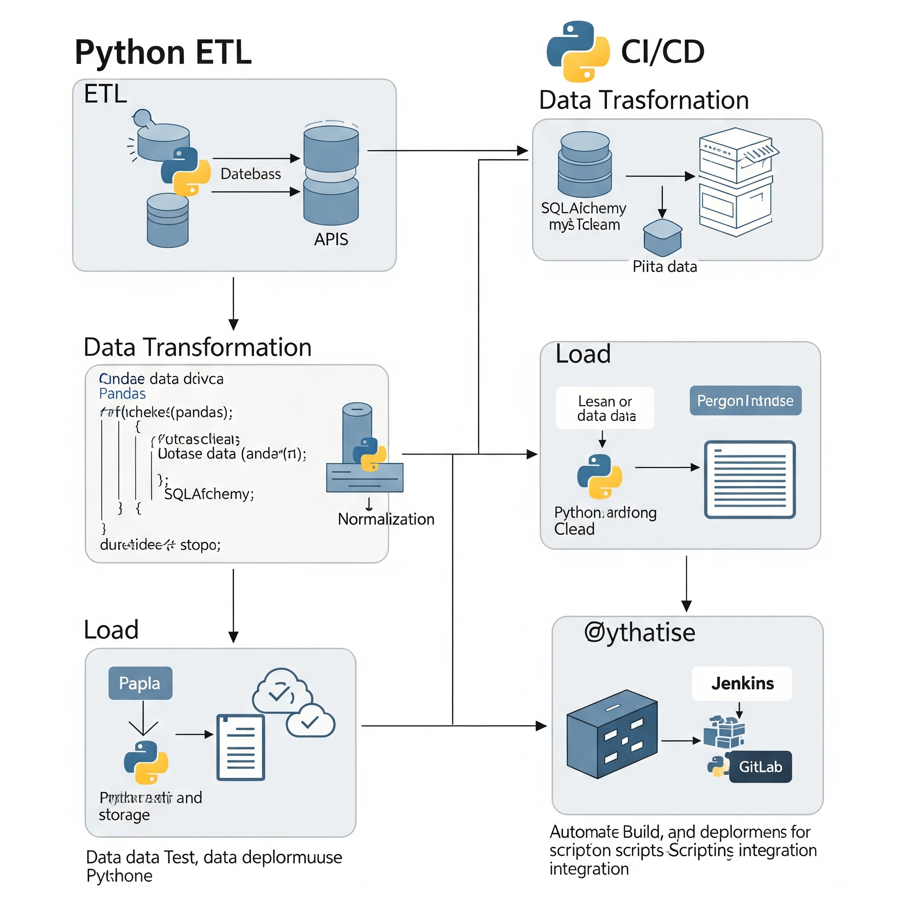
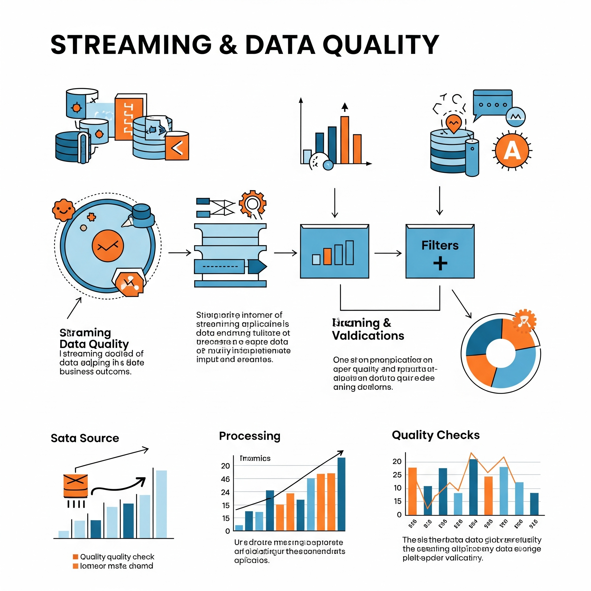
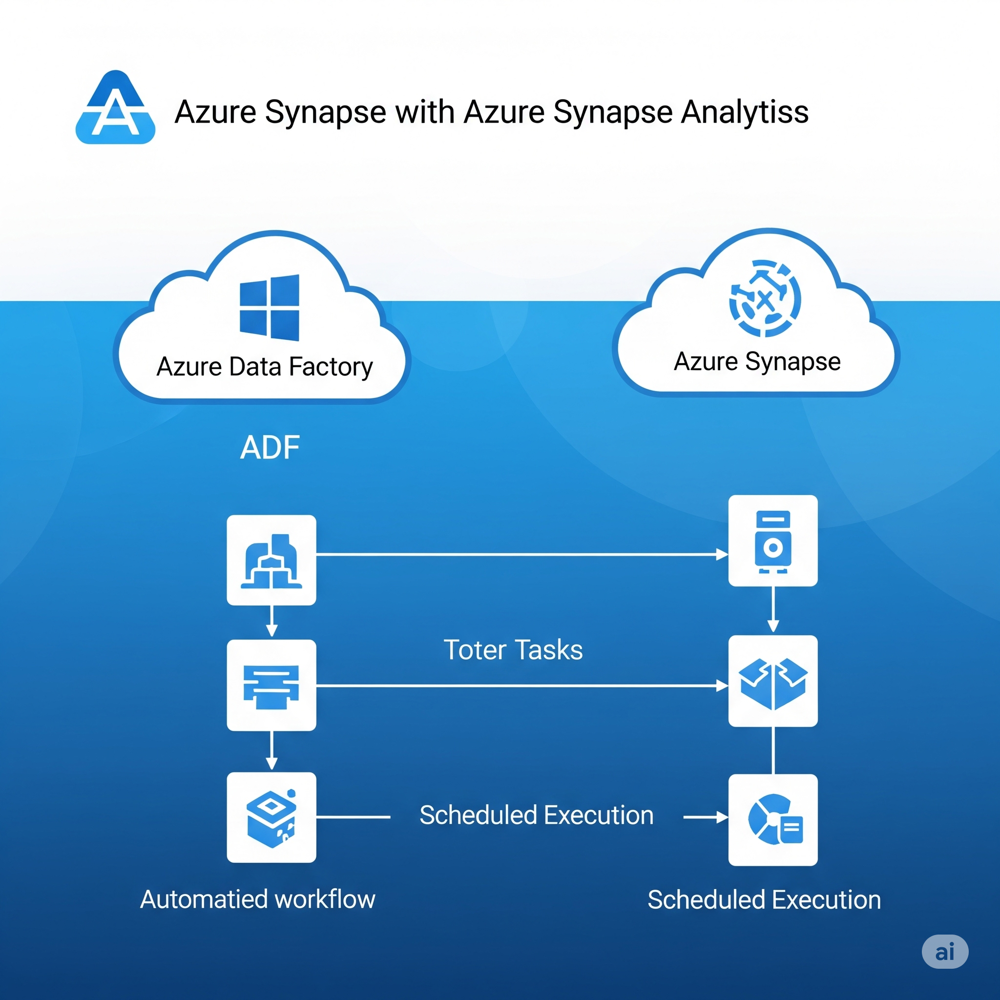

<!DOCTYPE html>
<html lang="en">
<head>
  <meta charset="UTF-8" />
  <meta name="viewport" content="width=device-width, initial-scale=1.0"/>
  <title>📚 Data Engineering Wiki</title>
  
</head>
<body>

  <!-- ───────────────────────── About Me ───────────────────────── -->
  <h1>👋 About Me</h1>
  

    

      Welcome to my data-engineering wiki! I'm a Power BI Developer with 3 years of experience,
      now diving deep into Azure data engineering and Microsoft Fabric.
    

    

      This site is my public knowledge base & portfolio as I up-skill from analyst to full-stack DE.
      Let’s connect on <a href="https://www.linkedin.com/in/cpvardhan/">LinkedIn</a>.
    

  

  <!-- ───────────────────────── Course Library ───────────────────────── -->
  <h2>🗂️ Course Library</h2>
  

    <a href="courses/fundamentals/overview/" class="module-card grad-blue">
      

        
      

      

        Fundamentals of Data Engineering
      

    </a>

    <a href="courses/python/python-overview/" class="module-card grad-yellow">
      

        
      

      

        Python
      

    </a>

    <a href="courses/power-bi-service/powerbi-service-overview/" class="module-card grad-teal">
      

        
      

      

        Power BI Service & Admin
      

    </a>

    <a href="cheat-sheets/cheatsheet-overview/" class="module-card grad-orange">
      

        
      

      

        Cheat Sheets
      

    </a>

    <a href="courses/sql-admin/sql-admin-overview/" class="module-card grad-blue">
      

        
      

      

        SQL Admin
      

    </a>

    <!-- placeholder to fill the 6th column -->
    

  

  <!-- ───────────────────────── Road-map Grid ───────────────────────── -->
  <h2>🗺️ Learning Road-map (30 weeks)</h2>
  
Click any module card for detailed tasks & resources.

  

    <a href="roadmap/module1/" class="module-card grad-blue">
      

        
      

      

        Module-1 DW & SQL Foundations
      

    </a>

    <a href="roadmap/module2/" class="module-card grad-yellow">
      

        
      

      

        Module-2 Python ETL & CI
      

    </a>

    <a href="roadmap/module3/" class="module-card grad-teal">
      

        
      

      

        Module-3 Spark & Delta Performance
      

    </a>

    <a href="roadmap/module4/" class="module-card grad-orange">
      

        
      

      

        Module-4 Streaming & Data Quality
      

    </a>

    <a href="roadmap/module5/" class="module-card grad-blue">
      

        
      

      

        Module-5 Azure Lakehouse
      

    </a>

    <a href="roadmap/module6/" class="module-card grad-yellow">
      

        
      

      

        Module-6 ADF & Synapse
      

    </a>

    <a href="roadmap/module7/" class="module-card grad-teal">
      

        
      

      

        Module-7 Fabric Lakehouse & Real-Time
      

    </a>

    <a href="roadmap/module8/" class="module-card grad-orange">
      

        
      

      

        Module-8 Interview & System Design
      

    </a>

  

</body>
</html>
