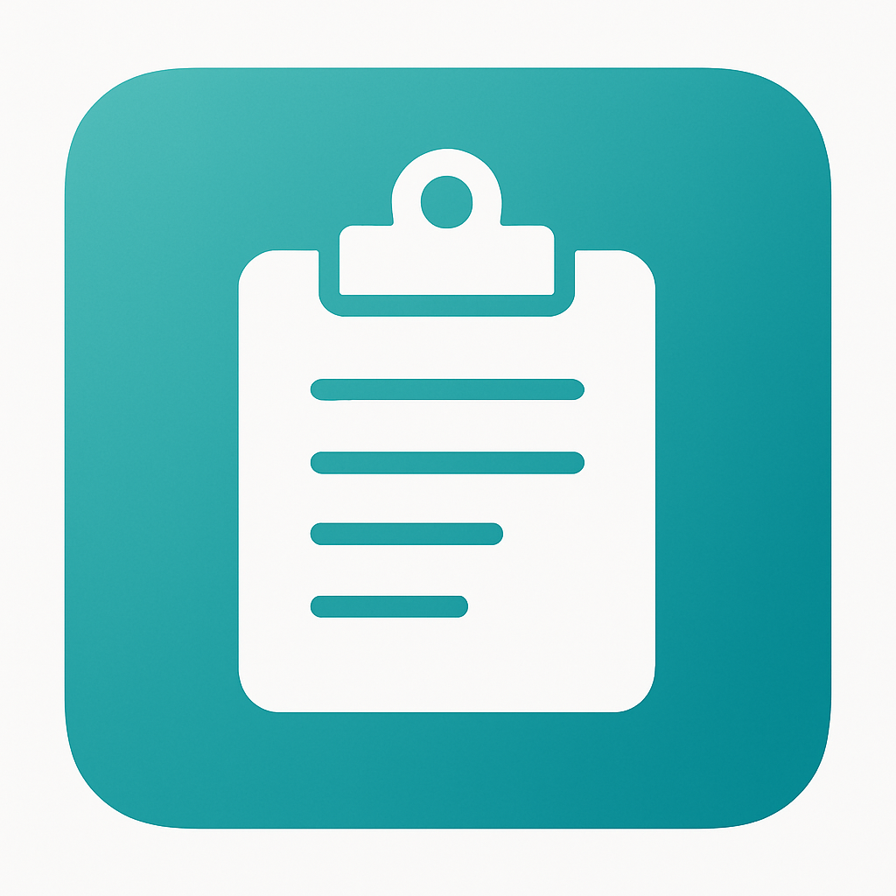

# 📚 Course Library
 

<a href="courses/sql-admin/" class="card-link card-blue">
  

    
  

  
SQL&nbsp;Admin

</a>

<a href="courses/python/" class="card-link card-yellow">
  

    
  

  
Python

</a>

<a href="courses/power-bi-service/powerbi-service-cheatsheet.html" class="card-link card-teal">
  

    
  

  
Power BI&nbsp;Service&nbsp;&amp;&nbsp;Admin

</a>

<a href="cheat-sheets/" class="card-link card-orange">
  

    
  

  
Cheat Sheets

</a>

 