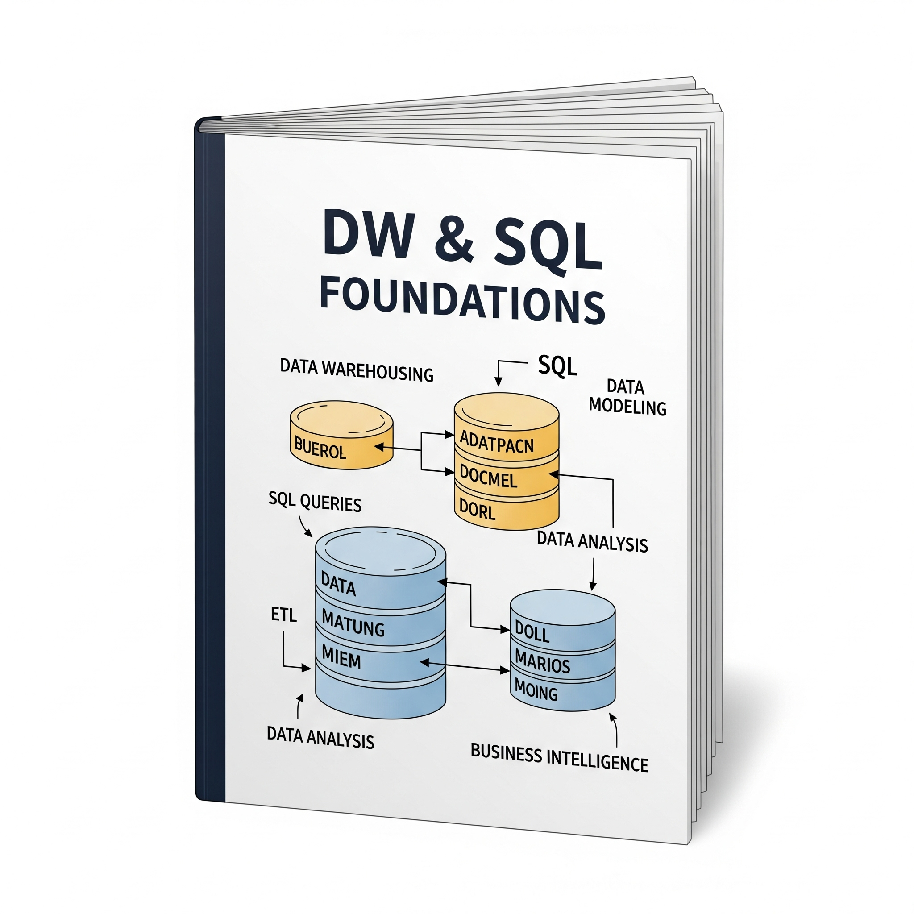

<!DOCTYPE html>
<html lang="en">
<head>
  <meta charset="UTF-8" />
  <meta name="viewport" content="width=device-width, initial-scale=1.0"/>
  <title>🚀 Learning Road-map</title>
  
</head>
<body>

  <h1>🚀 Learning Road-map (30 weeks)</h1>
  
Click any module card for detailed weekly tasks & resources.

  

    <a href="module1/" class="module-card grad-blue">
      

        
      

      

        Module-1 DW &amp; SQL Foundations
      

    </a>

    <a href="module2/" class="module-card grad-yellow">
      

        
      

      

        Module-2 Python ETL &amp; CI
      

    </a>

    <a href="module3/" class="module-card grad-teal">
      

        
      

      

        Module-3 Spark &amp; Delta Performance
      

    </a>

    <a href="module4/" class="module-card grad-orange">
      

        
      

      

        Module-4 Streaming &amp; Data Quality
      

    </a>

    <a href="module5/" class="module-card grad-blue">
      

        
      

      

        Module-5 Azure Lakehouse
      

    </a>

    <a href="module6/" class="module-card grad-yellow">
      

        
      

      

        Module-6 ADF &amp; Synapse
      

    </a>

    <a href="module7/" class="module-card grad-teal">
      

        
      

      

        Module-7 Fabric Lakehouse &amp; Real-Time
      

    </a>

    <a href="module8/" class="module-card grad-orange">
      

        
      

      

        Module-8 Interview &amp; System Design
      

    </a>

  

</body>
</html>
